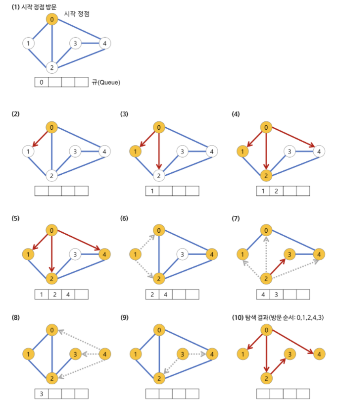

# 넓이 우선 탐색(BFS, Breadth-First Search) 알고리즘

## 📖개념
- 한 정점에 인접한 정점부터 순서대로 탐색하는 알고리즘
	- 깊게(deep) 탐색하기 전에, `넓게(wide)` 탐색하는 방식
	- 방문한 정점들을 차례대로 저장한 후, 순서대로 꺼낼 수 있는 자료구조 `큐(Queue)`를 사용한다.
	- `한 번 방문한 정점은 다시는 방문하지 않아야 한다.`
- <b>시간 복잡도</b>
	- `인접 리스트`로 구현한 그래프: `O(|V| + |E|)`
		- 그래프 내에 간선이 적은 `희소 그래프(Sparse Graph)`의 경우, 인접 리스트로 그래프를 구현하는 것이 효율적이다.
	- `인접 행렬`로 구현한 그래프: `O(|V|²)`
### 넓이 우선 탐색(BFS) 과정

___
## 💻구현
```c++
int N; // 정점 개수
vector<vector<int>> adj; // 그래프의 인접 리스트 표현
vector<bool> visited; // 정점 방문 여부

void BFS(int start){
	queue<int> cur, next;
	next.push(start);

	while (!next.empty()) {
		while (!next.empty()) {
			cur.push(next.front());
			next.pop();
		}
		while (!cur.empty()) {
			int vertex = cur.front();
			cur.pop();
			
			process();

			for (int i = 0; i < adj[vertex].size(); i++){
				if (!visited[adj[vertex][i]]){
					next.push(adj[vertex][i]);
					visited[adj[vertex][i]];
				}
			}			
		}
	}
}

void init(){
	adj.assign(N, vector<int>(N, -1));
	visited.assign(N, false);
	BSF(1);
}
```