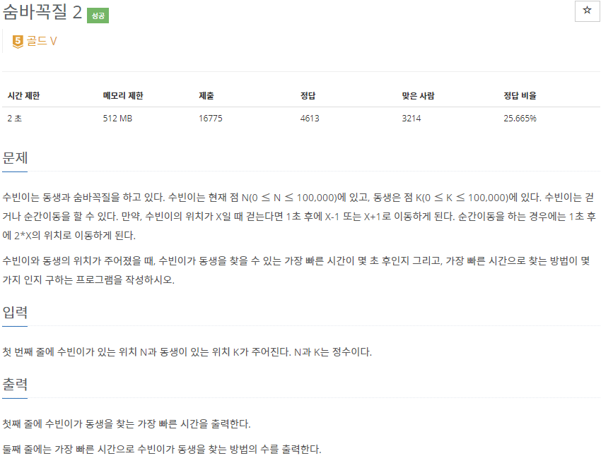
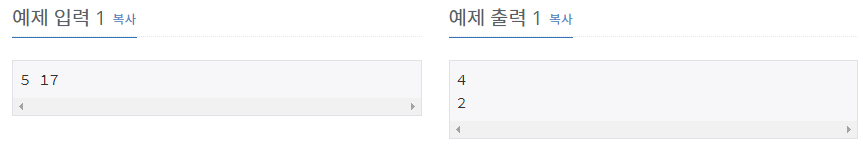

# [[12851] 숨바꼭질 2](https://www.acmicpc.net/problem/12851)



___
## 🤔접근
1. <b>걷거나 순간이동해서 동생의 위치를 찾는 문제</b>
	- 두 이동 수단 모두 1초로 동일하므로, 간선의 가중치가 모두 동일할 때 최단경로를 찾는 BFS 알고리즘을 이용하자.
2. <b>동생을 찾는 가장 빠른 시간과, 그 방법의 수를 구해야 한다.</b>
	- 각 위치별로 가장 빠르게 도착하는 시간을 저장하고, 동생의 위치에 도달하면 카운팅하자.
___
## 💡풀이
- <b>넓이 우선 탐색(BFS) 알고리즘</b>을(를) 사용하였다.
___
## ✍ 피드백
___
## 💻 핵심 코드
```c++
// BFS
while (!next.empty()) {
	while (!next.empty()) {
		cur.push(next.front());
		dp[next.front()] = time;
		next.pop();
	}

	while (!cur.empty()) {
		int loc = cur.front();
		cur.pop();
		
		if (loc == K) {
			cnt++;
			continue;
		}
		if (loc > 0 && dp[loc - 1] > time)
			next.push(loc - 1);
		if (loc < 100000 && dp[loc + 1] > time)
			next.push(loc + 1);
		if (2 * loc <= 100000 && dp[2 * loc] > time)
			next.push(2 * loc);
	}
	time++;
}
```