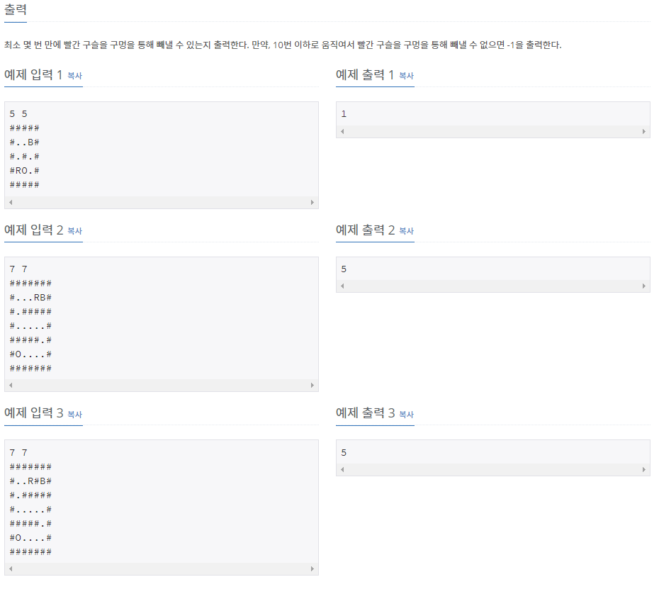

# [[13460] 구슬 탈출 2](https://www.acmicpc.net/problem/13460)



___
## 🤔접근
1. <b>보드를 4방향으로만 기울여서 빨간구슬만 구멍으로 넣는 경로를 구해야 한다.</b>
	- 보드를 최대 10번까지만 기울여보므로, BFS을 이용하여 최대 4¹⁰번 이내로 빠르게 해를 구할 수 있다.
___
## 💡풀이
- <b>너비 우선 탐색(BFS)</b>을(를) 사용하였다.
	- 구슬 배치의 경우의 수는 다음과 같다.
		1. R, B, 구멍이 동일 선상에 위치한 경우
			> ex) `#RB..O#` or `#BR..O#`
		2. R과 B 사이에 구멍이 존재하는 경우
			> ex) `#R..O.B#`
		3. R과 B가 동일 선상이 아닌 경우
	- 위에서 찾은 각각의 경우의 수를 참고하여, 다음과 같이 구현하였다.
		1. 빨간구슬 -> 파란구슬 순서로 기울여 본다.
			- 구슬이 이동하는 과정에서 구멍을 만난다면, 따로 표시하고 일단 계속 이동시킨다.
		2. 만약, 파란구슬이 구멍을 만났었다면, `실패`.
		3. 그렇지 않고 만약, 빨간구슬과 파란구슬이 겹쳐있다면, 다음 조건을 따져보자.
			1. 빨간구슬이 구멍을 만났었다면, `성공`.
				- `#R..0..B#` 상태에서 오른쪽으로 기울인 상황으로 이해하자.
			2. 그렇지 않다면, 구슬 위치를 조정한다.
				- 예를들어, 빨간구슬이 먼저 벽에 닿은 경우, 파란구슬을 뒤로 한 칸 이동시키는 식으로 조정
		4. 그렇지 않고 만약, 빨간구슬이 구멍을 만났었다면, `성공`.
		5. 성공 or 실패한 경우가 아니라면, 두 구슬 위치의 방문상태를 체크하자.
			- 두 구슬의 위치를 동시에 체크해야 한다.
			- 미방문 상태라면, 다음에 기울일 큐에 이동된 두 구슬 위치를 push하고, 방문상태를 true로 변경
		6. 위 과정을 최대 10번 기울일 때까지 반복하고, 이후로는 `실패`로 간주한다.	
___
## ✍ 피드백
1. <b>하... 이런 문제도 적응하고 풀자..😩</b>
___
## 💻 핵심 코드
```c++
int BFS(const pair<int, int>& R, const pair<int, int>& B, const vector<vector<char>>& board) {
	int ans = 1;
	int dr[] = {1, 0, -1, 0};
	int dc[] = {0, 1, 0, -1};
	bool visited[10][10][10][10] = {false}; // 두 구슬의 해당 위치 방문 여부

	queue<pair<int, int>> nextR, curR, nextB, curB;
	nextR.emplace(R);
	nextB.emplace(B);
	visited[R.first][R.second][B.first][B.second] = true;

	while (ans <= 10) {
		while (!nextR.empty()) {
			curR.emplace(nextR.front());
			curB.emplace(nextB.front());
			nextR.pop();
			nextB.pop();
		}

		while (!curR.empty()) {
			auto red = curR.front();
			auto blue = curB.front();
			curR.pop();
			curB.pop();

			for (int i = 0; i < 4; i++) {
				pair<int, int> newRed = red, newBlue = blue;
				bool isFind = false;
				bool isFail = false;

				while (board[newRed.first + dr[i]][newRed.second + dc[i]] != '#') { // R 기울이기
					newRed.first += dr[i];
					newRed.second += dc[i];
					if (board[newRed.first][newRed.second] == 'O') {
						isFind = true;
						break;
					}
				}
				while (board[newBlue.first + dr[i]][newBlue.second + dc[i]] != '#') { // B 기울이기
					newBlue.first += dr[i];
					newBlue.second += dc[i];
					if (board[newBlue.first][newBlue.second] == 'O') {
						isFail = true;
						break;
					}
				}

				if (isFail) // B가 구멍에 빠진 경우
					continue;
				else if (newRed == newBlue) { // R과 B가 겹친 경우
					if (isFind) // R이 구멍을 지나서 B랑 겹친 경우(=R만 구멍에 빠진 경우)
						return ans;
					if (dr[i] + dc[i] > 0) { // 우측 or 하단으로 기울인 경우
						if (red > blue) { // ->BR#
							newBlue.first -= dr[i];
							newBlue.second -= dc[i];
						}
						else { // ->RB#
							newRed.first -= dr[i];
							newRed.second -= dc[i];
						}
					}
					else { // 좌측 or 상단으로 기울인 경우
						if (red < blue) { // #RB<-
							newBlue.first -= dr[i];
							newBlue.second -= dc[i];
						}
						else { // #BR<-
							newRed.first -= dr[i];
							newRed.second -= dc[i];
						}
					}
				}
				else if (isFind) // R만 구멍에 빠진 경우
					return ans;

				if (!visited[newRed.first][newRed.second][newBlue.first][newBlue.second]) {
					visited[newRed.first][newRed.second][newBlue.first][newBlue.second] = true;
					nextR.push(newRed);
					nextB.push(newBlue);
				}
			}
		}

		ans++;
	}

	return -1;
}
```