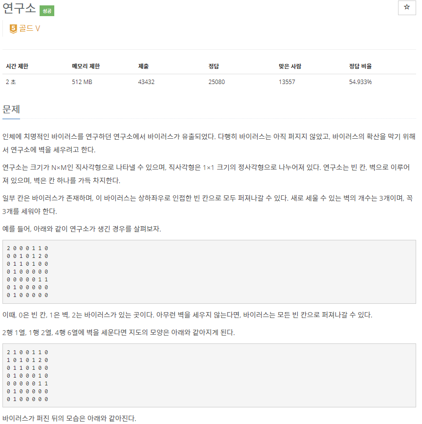
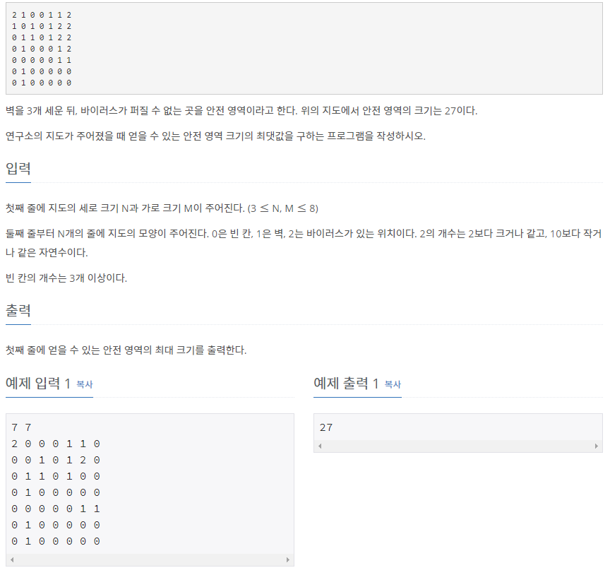

# [[14502] 연구소](https://www.acmicpc.net/problem/14502)



___
## 🤔접근
1. <b>벽을 새로 3개를 세우는 모든 경우의 수를 따져 보아야 한다.</b>
	- 연구실의 최대 크기는 8x8이며, 이 중에서 3개를 고르는 경우의 수(조합)은 `₆₄C₃`이다.
2. <b>벽을 새로 3개 세운 후, 바이러스가 퍼졌을 때의 안전 영역의 크기를 구해야 한다.</b>
	- 연구실 모두를 탐색하는 경우의 수는 최대 `8x8`이다.
	- 즉, worts case의 최대 연산 횟수는 `8 * 8 * ₆₄C₃ = 64 * 41,664 = 2,666,496`이다.
___
## 💡풀이
- 안전 영역의 모든 경우의 수를 구하기 위해 <b>백트래킹(Back-Tracking) 알고리즘</b>을(를) 사용하였다.
	- `n`: 선택된 새로 세울 벽의 개수
	- `idx`: idx 이전까지의 칸을 탐색했다는 의미
- 바이러스가 퍼지는 과정을 <b>너비 우선 탐색(BFS) 알고리즘</b>을 사용하여 구했다.
	- `infects`: 초기 바이러스들의 위치를 저장
		- 초기 바이러스들의 위치에 추가로 바이러스가 퍼지는 다른 경우들도 따져 보아야 하므로, 각 경우마다 복사하여 저장함.
	- `tmp`: 초기 연구실의 지도를 복사
		- 초기 연구실의 지도를 각각 다른 경우들에 적용해 보아야 하므로, 각 경우마다 복사하여 사용함.
___
## ✍ 피드백
1. <b>백트래킹 조합 문제는 항상 주의하자❗</b>
	- 순서만 다른 중복 케이스를 걸러내려면, 탐색 중인 인덱스 정보가 추가로 필요하다.
	- 현재 DFS에서 이전 DFS까지 탐색한 인덱스의 다음 원소부터 탐색해야 한다.
___
## 💻 핵심 코드
```c++
void DFS(int n, int idx) {
	int size = N * M;
	if (n == 3) {
		int dr[] = {-1, 1, 0, 0};
		int dc[] = {0, 0, -1, 1};
		int infected = 0;
		tmp = m;
		queue<pair<int, int>> infects = virus;

		// BFS
		while (!infects.empty()) {
			int row = infects.front().first;
			int col = infects.front().second;
			infects.pop();

			for (int i = 0; i < 4; i++) {
				if (row + dr[i] < 0 || row + dr[i] >= N || col + dc[i] < 0 || col + dc[i] >= M)
					continue;

				int newRow = row + dr[i];
				int newCol = col + dc[i];
				if (tmp[newRow][newCol] == 0) {
					infected++;
					tmp[newRow][newCol] = 2;
					infects.emplace(newRow, newCol);
				}
			}
		}
		
		ans = max(ans, safeArea - infected - 3);
	
		return;
	}

	for (int i = idx; i < size; i++) {
		int row = i / M;
		int col = i % M;
		if (m[row][col] != 0)
			continue;

		m[row][col] = 1;
		DFS(n + 1, i + 1);
		m[row][col] = 0; // back-tracking
	}
}
```