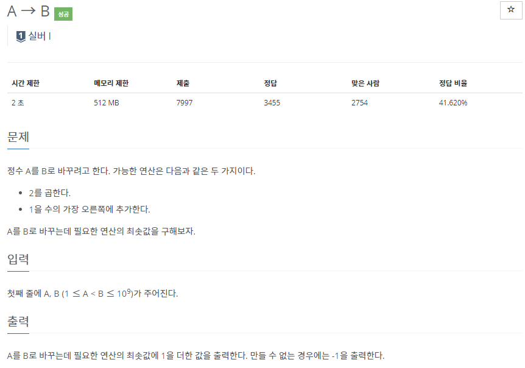
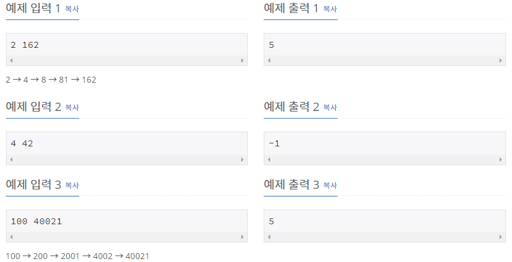

# [[16953] A -> B](https://www.acmicpc.net/problem/16953)



___
## 🤔접근
1. <b>A에 2를 곱하거나, 1을 맨 오른쪽에 추가하면서 B를 만들어야 한다.</b>
	- 각 정점마다 가중치가 1로 동일한 경로가 2개씩 있는 방향 그래프라고 생각하자.
	- 그렇다면, BFS로 해결할 수 있다.
___
## 💡풀이
- <b>BFS 알고리즘, unordered_map(hash map)</b>을(를) 사용하였다.
	- BFS를 이용하여 A에서 B를 만드는 최소 연산 횟수를 찾도록 구현하였다.
	- 각 정점(A를 변형한 값)마다 A부터의 최소 연산 횟수를 저장해야 한다.
		- 또한 이 값들은 정렬해서 저장할 필요가 없으므로 unorderd_map에 저장하였다.
___
## ✍ 피드백
1. <b>int와 long long의 값 비교는 가능한 것 같다.</b>
2. <b>lValue 타입이 long long이라면, rValue 타입도 long long이어야 한다.</b>
	- rValue 타입이 int라면 overflow가 발생한다.
3. <b>1부터 B까지 모든 숫자에 대해 연산의 횟수를 저장해서는 안 된다.</b>
	- 최대 10⁹ * 4byte 메모리를 할당해야 한다.
___
## 💻 핵심 코드
```c++
while (!next.empty()) {
	while (!next.empty()) {
		cur.push(next.front());
		next.pop();
	}

	while (!cur.empty()) {
		long long n = cur.front();
		cur.pop();
		m[n] = cnt;
		
		int Multiply2 = 2 * n;
		long long addToRight1 = n * 10 + 1;

		if (Multiply2 <= B) {
			if (m.find(Multiply2) == m.end()) 
				next.push(Multiply2);
			else if (m[Multiply2] > cnt + 1) 
				next.push(Multiply2);
		}
		if (addToRight1 <= B) {
			if (m.find(addToRight1) == m.end())
				next.push(addToRight1);
			else if (m[addToRight1] > cnt + 1)
				next.push(addToRight1);
		}
	}
	cnt++;
}
```