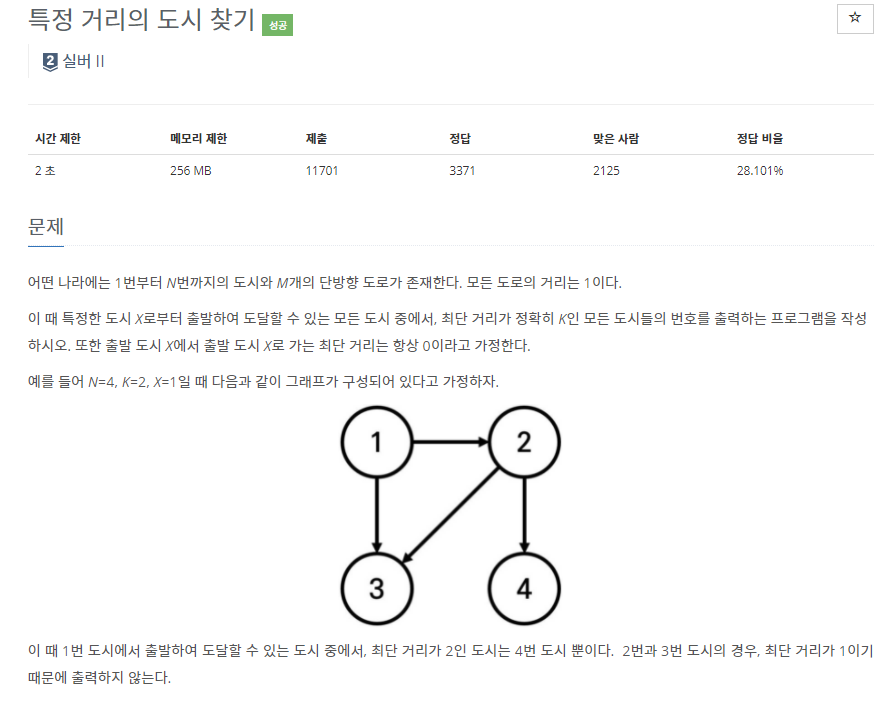

# [[18352] 특정 거리의 도시 찾기](https://www.acmicpc.net/problem/18352)



___
## 🤔접근
1. <B>가중치가 모두 동일하고, 최단 경로를 찾는 문제이므로, BFS를 사용하자.</B>
	- 가중치가 모두 동일한 경우 최단 경로를 찾는 알고리즘 중 BFS가 가장 효율적이다.
	- 시간 복잡도: `O(E)`
	- 최소 비용이 K를 초과하는 경우에는 탐색하지 않도록 구현하자.
___
## 💡풀이
- <B>알고리즘 & 자료구조</B>
	- `BFS`
- <b>구현</b>
	- 너비 우선 탐색 알고리즘을 구현하여 해결하였다.
___
## ✍ 피드백
___
## 💻 핵심 코드
```c++
vector<int> BFS(const vector<vector<int>>& adj, const int& N, const int& src, const int& K) {
	queue<pair<int, int>> cur, next; // <dist, city>
	vector<bool> isVisited(N + 1);
	vector<int> ans;

	int dist = 0;
	isVisited[src] = true;
	next.emplace(0, src);
	while (!next.empty()) {
		while (!next.empty()) {
			cur.emplace(next.front());
			next.pop();
		}

		while (!cur.empty()) {
			int dist = cur.front().first;
			int city = cur.front().second;
			cur.pop();

			if (dist == K) {
				ans.push_back(city);
				continue;
			}

			for (int adjCity : adj[city]) {
				if (isVisited[adjCity])
					continue;

				isVisited[adjCity] = true;
				next.emplace(dist + 1, adjCity);
			}
		}
	}

	return ans;
}
```