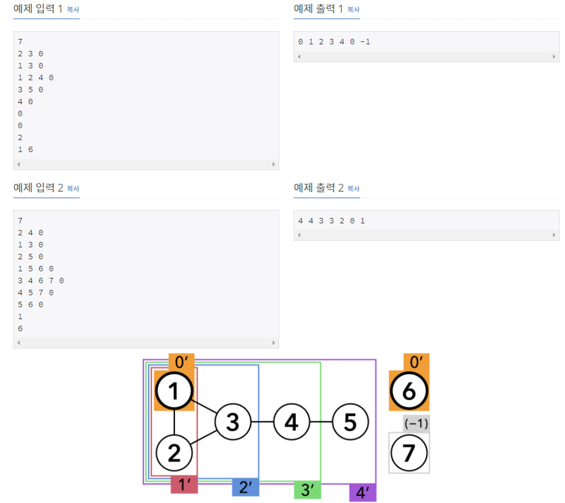

# [[19538] 루머](https://www.acmicpc.net/problem/19538)



___
## 🤔접근
1. <b>최초 루머 유포자를 기점으로 주변인으로 루머가 퍼져나가는 것을 구현해야 한다.</b>
	- 동시간대 처리를 위해 BFS를 이용하여 구현하자.
___
## 💡풀이
- <b>너비 우선 탐색(BFS) 알고리즘</b>을(를) 사용하였다.
	- 구현 과정은 다음과 같다.
		1. 주변인 정보 입력
			- `adj` 2차원 배열에 저장
		2. 최초 루머 유포자 입력
			- `ans` 1차원 배열에 값을 0으로 저장 (최초 초기화는 -1임)
		3. 최초 루머 유포자들의 주변인을 중복되지 않게 큐에 삽입
			- `visited` 1차원 배열 이용 중복 체크
		4. 동시간대 처리를 위해 두 개의 큐(`next`, `cur`)를 이용하여 BFS 구현
			1. 큐에서 한 명씩 꺼내어 다음의 작업을 수행한다.
				- 현재 사람의 주변인들 중 루머를 믿는 사람이 과반수라면, `next` 큐에 삽입
			2. `next` 큐에는 현재 시각 기준으로 루머를 믿게 된 사람들이므로, `ans` 배열에 현재 시각을 저장하고, `cur` 큐에 해당 사람들을 삽입
			3. `cur` 큐에서 한 명씩 꺼내어 다음의 작업을 수행한다.
				- 현재 사람의 주변인들 중 루머를 믿지 않는 사람들을 중복되지 않게 `next` 큐에 삽입
		5. 현재 시간 1 증가
		6. 위 과정을 `next` 큐에 더 이상 사람이 삽입되지 않을 때까지 반복한다.
___
## ✍ 피드백
___
## 💻 핵심 코드
```c++
int main(){
	...
	queue<int> next, cur;
	vector<vector<int>> adj(N + 1); // 주변인 정보
	vector<bool> visited(N + 1, false);
	vector<int> ans(N + 1, -1); // -1으로 초기화

	for (int u = 1; u <= N; u++) {
		int v;
		while (true) {
			cin >> v;
			if (v == 0)
				break;

			adj[u].push_back(v);
		}
	}

	int M;
	cin >> M;
	for (int i = 0; i < M; i++) {
		int u;
		cin >> u;

		ans[u] = 0; // 최초 루머 유포자
		cur.push(u);
	}
	while (!cur.empty()) { // 최초 루머 유포자들이 모두 정해진 뒤에 처리를 해야 한다.
		int u = cur.front();
		cur.pop();
		for (int v : adj[u]) {
			if (ans[v] < 0 && !visited[v]) { // 최초 루머 유포자들의 주변인을 중복되지 않게 큐에 삽입
				next.push(v);
				visited[v] = true;
			}
		}
	}

	int time = 1;
	while (!next.empty()) {
		while (!next.empty()) {
			cur.push(next.front());
			next.pop();
		}

		while (!cur.empty()) {
			int u = cur.front();
			cur.pop();
			
			int cnt = 0;
			for (int v : adj[u]) // 현재 사람의 주변인에 루머를 믿는 사람의 수 카운팅
				if (ans[v] >= 0) 
					cnt++;
			if (adj[u].size() <= cnt * 2) // 현재 사람의 주변인에 루머를 믿는 사람이 과반수라면, 큐에 삽입
				next.push(u);
		}

		while (!next.empty()) { // 동시간대 처리를 위해 위의 작업과 분리함
			ans[next.front()] = time; // 루머를 믿게 된 시간을 체크
			cur.push(next.front());
			next.pop();
		}

		fill(visited.begin(), visited.end(), false);
		while (!cur.empty()) { // 동시간대 처리를 위해 위의 작업과 분리함
			int u = cur.front();
			cur.pop();

			for (int v : adj[u]) {
				if (ans[v] < 0 && !visited[v]) { // 현재 시각에 루머를 믿게 된 사람들의 주변인을 중복되지 않게 큐에 삽입
					next.push(v);
					visited[v] = true;
				}
			}
		}
		time++;
	}

	for (int i = 1; i <= N; i++)
		cout << ans[i] << ' ';
}
```