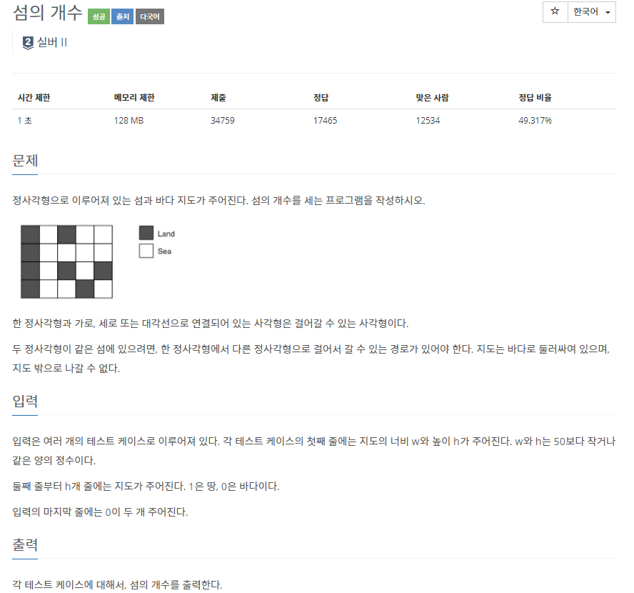
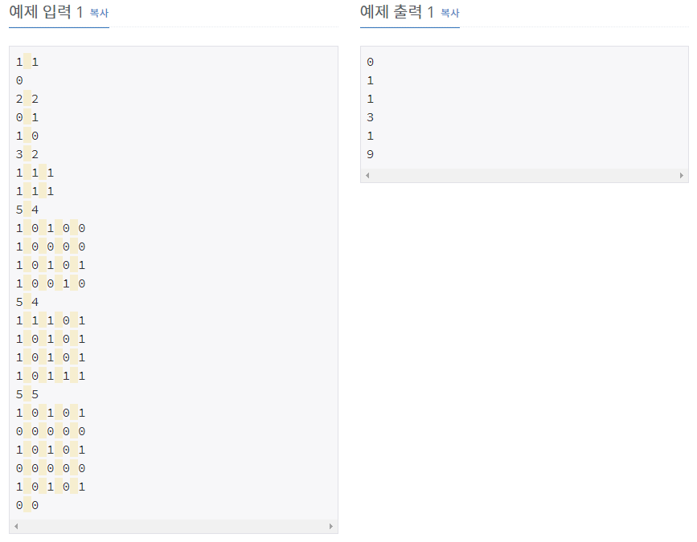

# [[4963] 섬의 개수](https://www.acmicpc.net/problem/4963)



___
## 🤔접근
- 8방향으로 이어진 땅을 하나의 섬이라 할 때, 섬의 개수를 구하는 문제이다.
___
## 💡풀이
- <B>알고리즘 & 자료구조</B>
	- BFS
- <b>구현</b>
	- 8방향으로 BFS 탐색하여 섬의 개수를 구하였다.
___
## ✍ 피드백
___
## 💻 핵심 코드
```c++
for (int i = 0; i < r; i++) {
	for (int j = 0; j < c; j++) {
		if (m[i][j] == 0 || isVisited[i][j])
			continue;
		
		ans++;
		q.emplace(i, j);
		isVisited[i][j] = true;
		while (!q.empty()) {
			int row = q.front().first;
			int col = q.front().second;
			q.pop();
			for (int i = 0; i < 8; i++) {
				int nextRow = row + dr[i];
				int nextCol = col + dc[i];
				if (nextRow < 0 || nextCol < 0 || nextRow >= r || nextCol >= c)
					continue;
				if (isVisited[nextRow][nextCol])
					continue;
				if (m[nextRow][nextCol] == 0)
					continue;
				isVisited[nextRow][nextCol] = true;
				q.emplace(nextRow, nextCol);
			}
		}
	}
}
cout << ans << '\n';
```