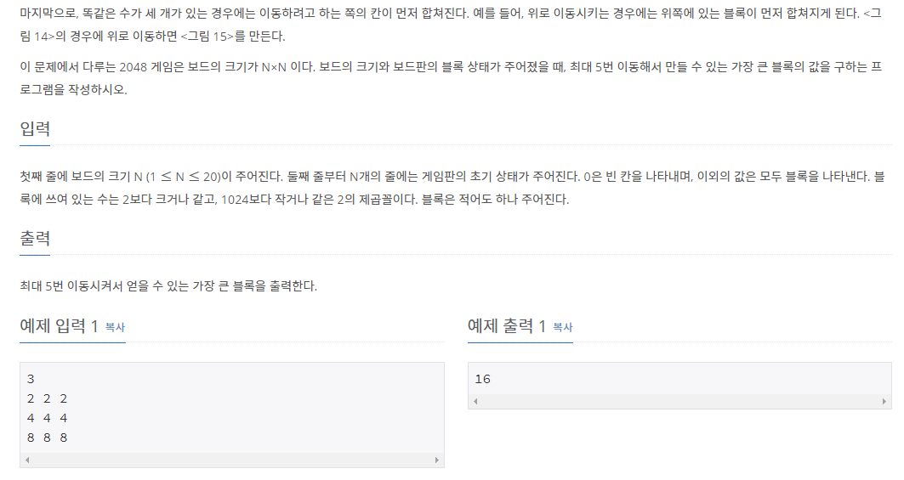

# [[12100] 2048 (Easy)](https://www.acmicpc.net/problem/12100)



___
## 🤔접근
1. <b>각 블록들을 4방향으로 이동시킬 수 있다.</b>
	- 인접한 두 블록의 숫자가 같으면, 이동하는 방향에 위치한 블록으로 합체시키고, 그 블록의 숫자는 두 숫자의 합이 된다.
	- 자료구조 큐(Queue)를 이용하여 한 줄씩 처리하자.
	- 이동은 최대 5번까지 가능하다.
___
## 💡풀이
- <b>백트래킹(Backtracking) 알고리즘</b>을(를) 사용하였다.
	- 각 분기마다 현재 초기 상태의 보드를 따로 저장하고, 4방향으로 각각 이동시킬 때 마다, 이동이 끝나면 초기 상태의 보드로 원상복귀시킨다.
	- 블록을 각 방향으로 이동시킬 때는 자료구조 `큐(Queue)`를 이용하여 한 줄씩 처리하였다.
		- 큐에서 하나씩 원소를 빼내어 이동방향의 끝부터 채워나간다.
			1. 해당 위치에 블록이 없으면, 현재 블록을 이동시켜 놓는다.
			2. 해당 위치에 같은 블록이 있으면, 해당 위치의 블록의 숫자를 두 배 해준다.
			3. 해당 위치에 다른 블록이 있으면, 다음 위치에 현재 블록을 이동시켜 놓는다.
___
## ✍ 피드백
___
## 💻 핵심 코드
```c++
void move(int type) {
	queue<int> q;
	switch (type) {
		case 0: // UP
			for (int c = 0; c < N; c++) {
				for (int r = N - 1; r >= 0; r--) {
					if (board[r][c] != 0)
						q.push(board[r][c]);
					board[r][c] = 0;
				}
				int idx = N - 1;
				while (!q.empty()) {
					int data = q.front();
					q.pop();
					
					if (board[idx][c] == 0)
						board[idx][c] = data;
					else if (board[idx][c] == data)
						board[idx--][c] *= 2;
					else
						board[--idx][c] = data;
				}
			}
			break;
		case 1: // RIGHT
			for (int r = 0; r < N; r++) {
				for (int c = N - 1; c >= 0; c--) {
					if (board[r][c] != 0)
						q.push(board[r][c]);
					board[r][c] = 0;
				}
				int idx = N - 1;
				while (!q.empty()) {
					int data = q.front();
					q.pop();
					
					if (board[r][idx] == 0)
						board[r][idx] = data;
					else if (board[r][idx] == data)
						board[r][idx--] *= 2;
					else
						board[r][--idx] = data;
				}
			}
			break;
		case 2: // DOWN
			for (int c = 0; c < N; c++) {
				for (int r = 0; r < N; r++) {
					if (board[r][c] != 0)
						q.push(board[r][c]);
					board[r][c] = 0;
				}
				int idx = 0;
				while (!q.empty()) {
					int data = q.front();
					q.pop();

					if (board[idx][c] == 0)
						board[idx][c] = data;
					else if (board[idx][c] == data)
						board[idx++][c] *= 2;
					else
						board[++idx][c] = data;
				}
			}
			break;
		case 3:
			for (int r = 0; r < N; r++) {
				for (int c = 0; c < N; c++) {
					if (board[r][c] != 0)
						q.push(board[r][c]);
					board[r][c] = 0;
				}
				int idx = 0;
				while (!q.empty()) {
					int data = q.front();
					q.pop();

					if (board[r][idx] == 0)
						board[r][idx] = data;
					else if (board[r][idx] == data)
						board[r][idx++] *= 2;
					else
						board[r][++idx] = data;
				}
			}
			break;
	}
}

void DFS(int n) {
	if (n == 5) {
		for (int i = 0; i < N; i++)
			for (int j = 0; j < N; j++)
				maxBlock = max(maxBlock, board[i][j]);
		return;
	}
	vector<vector<int>> copy = board;

	for (int i = 0; i < 4; i++) {
		move(i);
		DFS(n + 1);
		board = copy;
	}
}
```