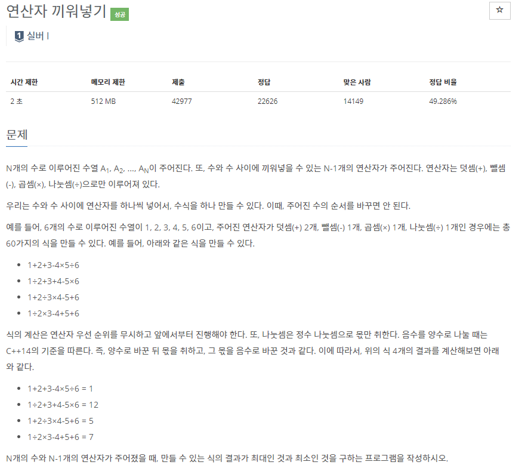
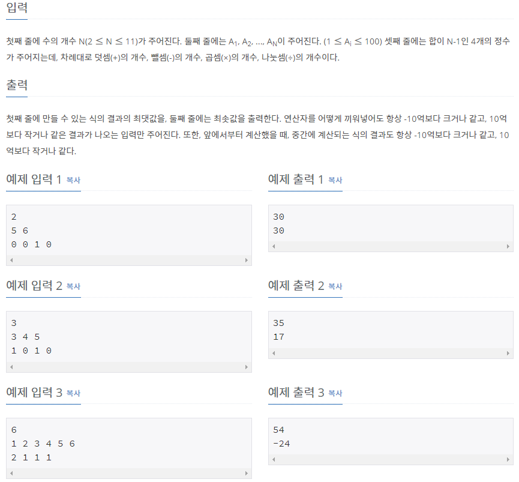

# [[14888] 연산자 끼워넣기](https://www.acmicpc.net/problem/14888)



___
## 🤔접근
1. <b>주어진 수의 순서를 바꾸지 않고, 사이에 주어진 연산자들을 넣어 나올 수 있는 최댓/최솟값 구하기</b>
	- 첫 번째 수부터 순서대로 탐색하면서, 주어진 연산자를 하나씩 사용하여 나올 수 있는 모든 경우의 수를 구하자.
___
## 💡풀이
- <b>Backtracking 알고리즘</b>을(를) 사용하였다.
	- 연산자의 개수가 0개이면, 탐색을 제한하며, 1개 이상이면 해당 연산을 수행한 결과를 포함하여 다음 수로 넘어간다.
	- 모든 수를 연산하였으면, 최솟/최댓값을 갱신하고, back-tracking한다.

___
## ✍ 피드백
___
## 💻 핵심 코드
```c++
void DFS(int n, int result) {
	if (n == N) {
		if (result < minValue)
			minValue = result;
		if (result > maxValue)
			maxValue = result;
		return;
	}

	for (int i = 0; i < 4; i++) {
		if (opr[i]) {
			opr[i]--;
			if (i == 0)
				DFS(n + 1, result + seq[n]);
			else if (i == 1)
				DFS(n + 1, result - seq[n]);
			else if (i == 2)
				DFS(n + 1, result * seq[n]);
			else if (i == 3)
				DFS(n + 1, result / seq[n]);
			// Backtracking
			opr[i]++;
		}
	}
}
```