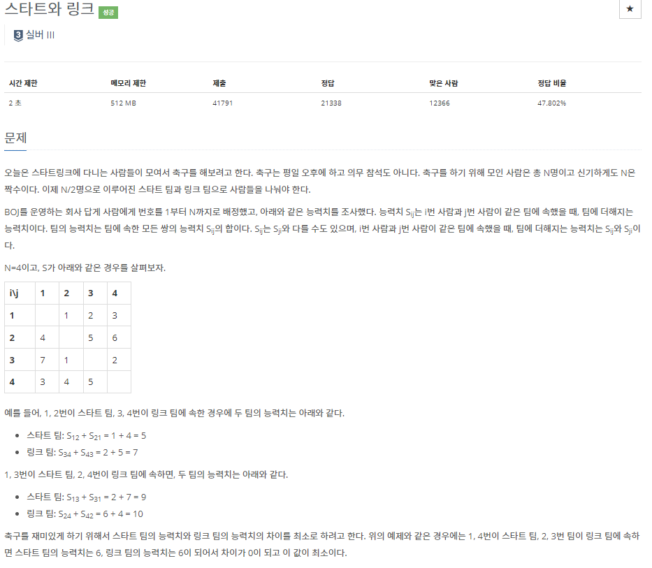
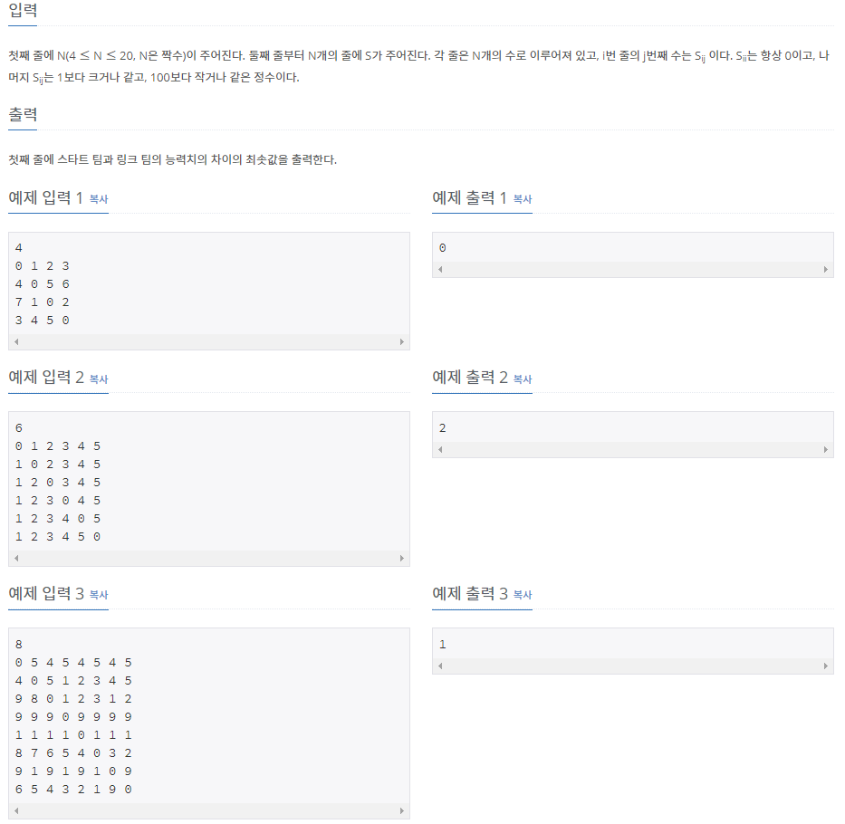

# [[14889] 스타트와 링크](https://www.acmicpc.net/problem/14889)



___
## 🤔접근
1. <b>N/2명씩 팀을 이루었을 때의 각 팀의 능력치의 최소 차를 구하라.</b>
	- 첫 번째 사람부터 탐색하면서, N/2명이 스타트 팀을 이루면, 나머지는 알아서 링크 팀으로 맺어진다.
	- `순서는 고려하지 않으므로`, 중복되는 탐색을 하지 않도록 구현해야 한다.
___
## 💡풀이
- <b>Backtracking 알고리즘</b>을(를) 사용하였다.
	- start팀에 속한 사람들의 정보를 bitmask에 저장한다.
	- 순서만 다르게 중복하여 팀을 이루는 경우는 다음과 같이 배재했다.
		- 탐색하고 있는 인덱스(idx)를 매개변수로 넘겨, 이미 탐색한 idx 이전의 사람들은 다시 탐색하지 않도록 하였다.
		- 즉, idx부터 N-1번째 까지의 사람들만 탐색한다.

___
## ✍ 피드백
1. <b>처음에는 순서만 다르게 중복하여 팀을 이루는 경우를 set 자료구조를 이용하여 해결하였다.</b>
	- 그러다 보니, 메모리 오버헤드와 탐색, 정렬 등의 시간 오버헤드가 발생하였다.
	- 첫 번째 사람부터 순서대로 탐색하므로, `인덱스 정보`를 활용하여 이전에 탐색한 사람은 탐색하지 않도록 함으로써 보다 효율적인 코드를 완성하였다.
___
## 💻 핵심 코드
```c++
void DFS(int n, int idx, int bitmask) {
	if (n == N / 2) {
		int start = 0, link = 0;

		for (int i = 0; i < N; i++) {
			for (int j = i + 1; j < N; j++) {
				if ((bitmask & (1 << i)) && (bitmask & (1 << j)))
					start += (ability[i][j] + ability[j][i]);
				if (!(bitmask & (1 << i)) && !((bitmask & (1 << j))))
					link += (ability[i][j] + ability[j][i]);
			}
		}
		
		int result = abs(start - link);
		if(minValue > result)
			minValue = result;

		return;
	}


	for (int i = idx; i < N; i++) {
		if (bitmask & (1 << i))
			continue;

		bitmask |= (1 << i);
		DFS(n + 1, i + 1, bitmask);
		// back-tracking
		bitmask &= ~(1 << i);
	}
}
```