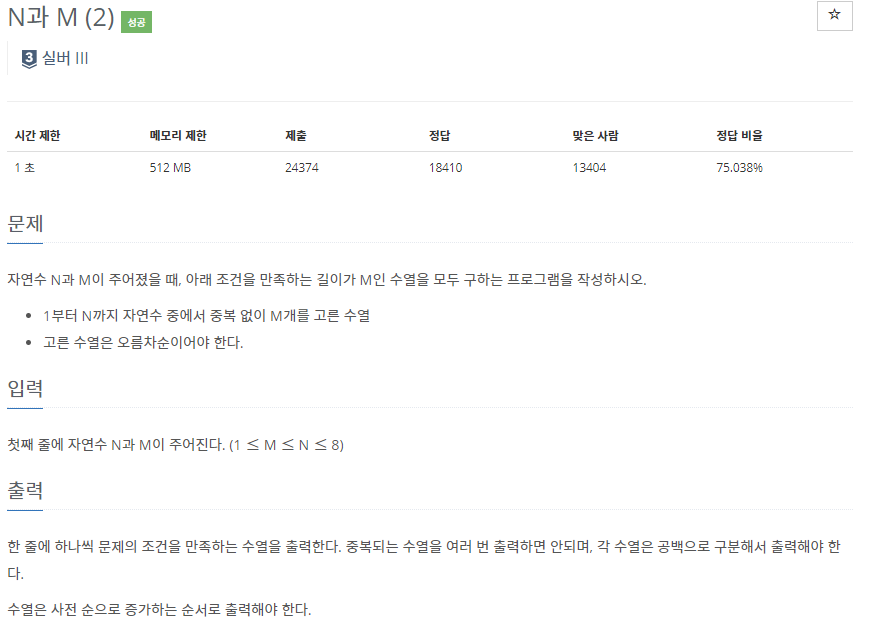
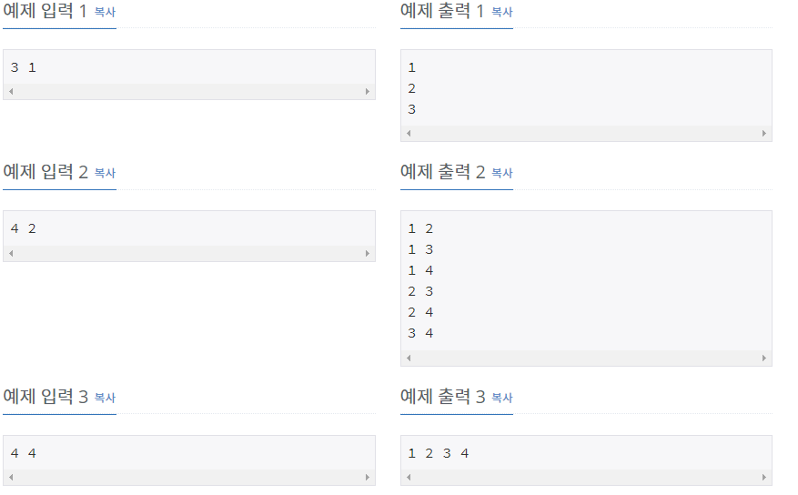

# [[15649] N과 M(2)](https://www.acmicpc.net/problem/15650)



___
## 🤔접근
1. <b>1 ~ N의 자연수 M개를 오름차순으로 고른 수열을 중복없이, 사전 순으로 증가하는 순서로 출력해야 한다.</b>
	- 이러한 제한을 만족하면서 전체 경우의 수를 탐색해야 한다.
___
## 💡풀이
- <b>Backtracking 알고리즘</b>을(를) 사용하였다.
	- bitmask를 이용하여 사용된 자연수를 체크하고, 사용할 자연수는 vector에 저장한 뒤, vector의 size가 M이 되면 원소를 차례대로 출력한다.
___
## ✍ 피드백
___
## 💻 핵심 코드
```c++
void DFS(int bitmask) {
	if (v.size() == M) {
		for (int n : v)
			cout << n << ' ';
		cout << '\n';
	}

	for (int i = 1; i <= N; i++) {
		if (bitmask & (1 << i))
			continue;
		if (!v.empty() && v.back() > i)
			continue;

		v.push_back(i);
		DFS(bitmask | (1 << i));
		v.pop_back();
	}
}
```