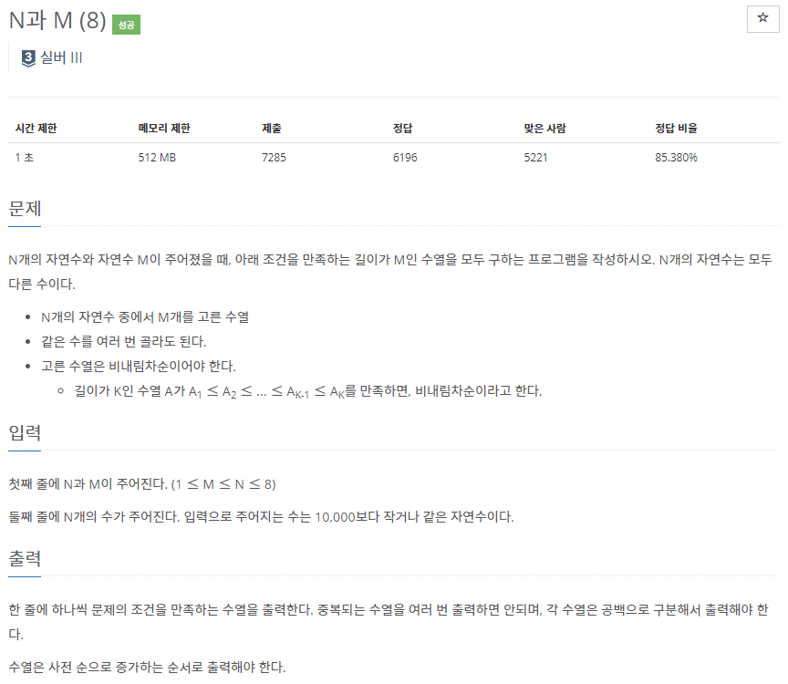
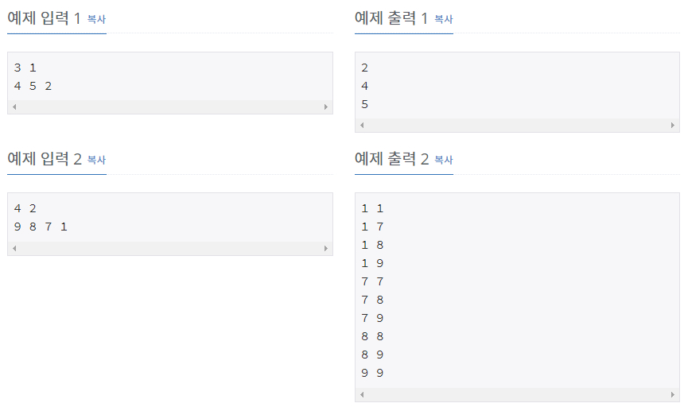

# [[15657] N과 M(8)](https://www.acmicpc.net/problem/15657)



___
## 🤔접근
1. <b>주어진 N개의 자연수 M개를 중복 허용하여 비내림차순으로 고른 수열을, 사전 순으로 증가하는 순서로 출력해야 한다.</b>
	- 이러한 제한을 만족하면서 전체 경우의 수를 탐색해야 한다.
___
## 💡풀이
- <b>Backtracking 알고리즘</b>을(를) 사용하였다.
	- 사용할 자연수는 vector에 저장한 뒤, vector의 size가 M이 되면 원소를 차례대로 출력한다.
___
## ✍ 피드백
___
## 💻 핵심 코드
```c++
void DFS() {
	if (result.size() == M) {
		for (int r : result)
			cout << r << ' ';
		cout << '\n';
		return;
	}

	for (int i = 0; i < N; i++) {
		// 비내림차순
		if (!result.empty() && result.back() > seq[i])
			continue;

		result.push_back(seq[i]);
		DFS();
		// back-tracking
		result.pop_back();
	}
}
```