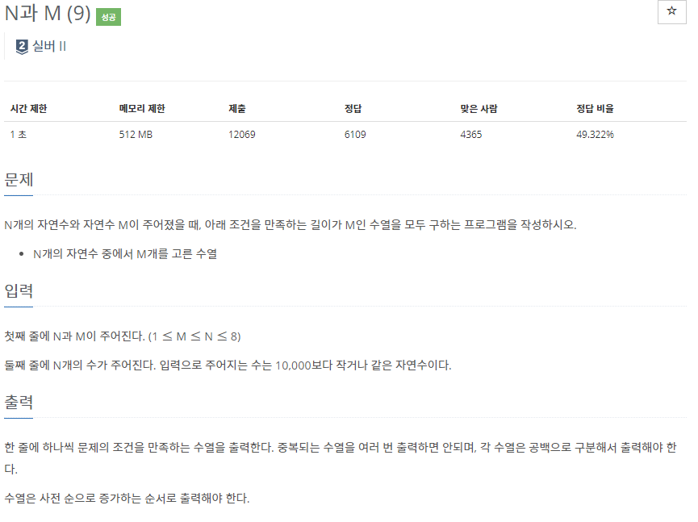
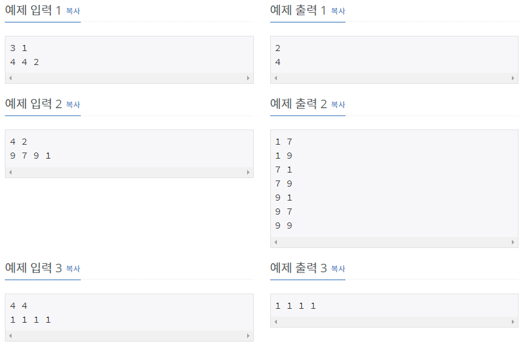

# [[15663] N과 M(9)](https://www.acmicpc.net/problem/15663)



___
## 🤔접근
1. <b>주어진 N개의 자연수 M개를 중복 불허하여 고른 수열을, 사전 순으로 증가하는 순서로 출력해야 한다.</b>
	- 이러한 제한을 만족하면서 전체 경우의 수를 탐색해야 한다.
2. <b>동일한 자연수가 여러 개 입력으로 주어질 수 있다.</b>
	- 이는 서로 다른 원소로 간주하지만, 최종 수열을 완성 시킬 때는 중복되는 수열이 없도록 해야 한다.
___
## 💡풀이
- <b>Backtracking 알고리즘</b>을(를) 사용하였다.
	- bitmask를 이용하여 사용된 자연수를 체크하고, 사용할 자연수는 vector에 저장한 뒤, vector의 size가 M이 되면 원소를 차례대로 출력한다.
___
## ✍ 피드백
___
## 💻 핵심 코드
```c++
void DFS(int bitmask) {
	if (result.size() == M) {
		for (int r : result)
			cout << r << ' ';
		cout << '\n';
		return;
	}
	vector<bool> flag(10001, false);

	for (int i = 0; i < N; i++) {
		if (bitmask & (1 << i)) // 중복 원소 불허
			continue;
		if (flag[seq[i]] == true) // 중복 자연수 불허
			continue;

		flag[seq[i]] = true;
		result.push_back(seq[i]);
		DFS(bitmask | (1 << i));
		// back-tracking
		result.pop_back();
	}
}
```