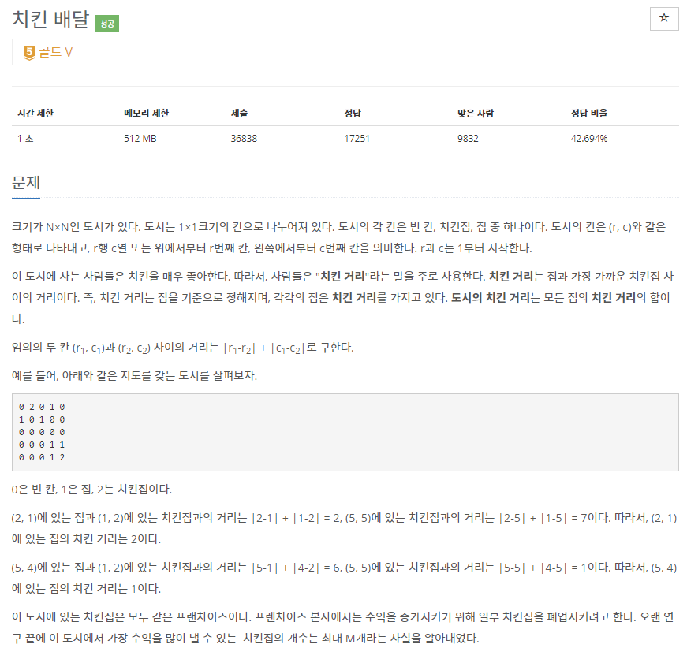
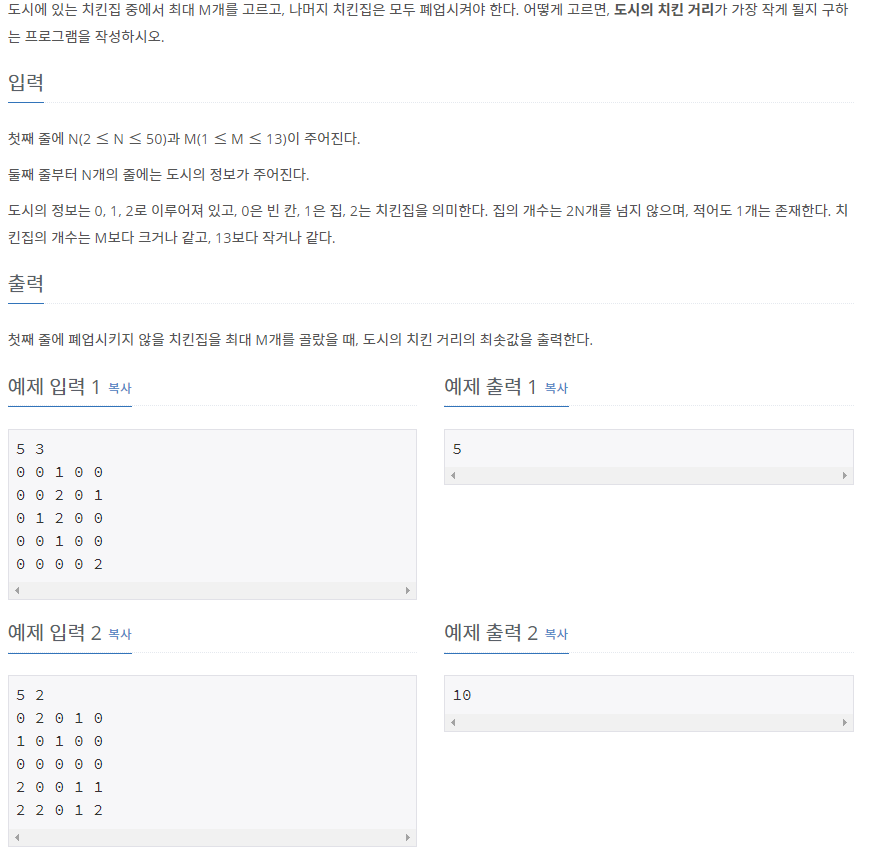

# [[15686] 치킨 배달](https://www.acmicpc.net/problem/15686)



___
## 🤔접근
1. <b>집과 치킨집의 위치 정보만 따로 저장하자.</b>
	- 치킨 거리는 `집과 치킨집 위치의 차` 이므로 필요 없는 빈 칸를 메모리를 낭비하면서까지 저장할 필요가 없다.
2. <b>주어진 치킨집 중에서 M개만 선택해야 한다.</b>
	- 집을 순서대로 탐색하면서, `백트래킹` 기법을 이용하여 치킨집 M개를 선택하는 경우의 수(`조합`)을 구하자.
___
## 💡풀이
- <b>백트래킹(Back-Tracking) 알고리즘</b>을(를) 사용하였다.
	- `n`: 선택된 치킨집 수
	- `idx`: idx 이전까지의 치킨집을 탐색했다는 의미
	- `bitmask`: 선택한 치킨집 정보
___
## ✍ 피드백
1. <b>백트래킹 조합 문제는 항상 주의하자❗</b>
	- 순서만 다른 중복 케이스를 걸러내려면, 탐색 중인 인덱스 정보가 추가로 필요하다.
	- 현재 DFS에서 이전 DFS까지 탐색한 인덱스의 다음 원소부터 탐색해야 한다.

___
## 💻 핵심 코드
```c++
void DFS(int n, int idx, int bitmask) {
	if (n == M) {
		int sum = 0;
		for (int i = 0; i < house.size(); i++) {
			int chickenRoad = 100000000;
			for (int j = 0; j < chicken.size(); j++) 
				if (bitmask & (1 << j)) 
					chickenRoad = min(chickenRoad, abs(chicken[j].first - house[i].first) + abs(chicken[j].second - house[i].second));	
			sum += chickenRoad;
		}

		ans = min(ans, sum);
		return;
	}

	for (int i = idx; i < chicken.size(); i++) { // idx부터 탐색 -> 중복 제거
		if (bitmask & (1 << i))
			continue;

		DFS(n + 1, i + 1, bitmask | (1 << i));
	}
}
```