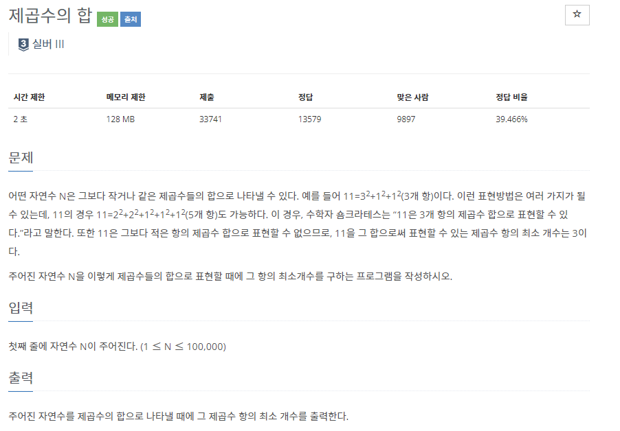
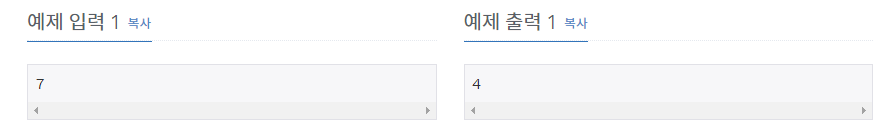

# [[15811] 복면산?!](https://www.acmicpc.net/problem/15811)



___
## 🤔접근
1. <b>주어진 단어들의 알파벳에 각각 0 ~ 9를 한 번씩 넣었을 때 나올 수 있는 모든 경우의 수를 따져보자.</b>
___
## 💡풀이
- <B>알고리즘 & 자료구조</B>
	- `Backtracking`
- <b>구현</b>
	- 입력된 단어(`string word[3]`) 순서대로 한 알파벳씩 탐색하면서, 각각 0 ~ 9의 숫자를 한 번씩 부여하였다.
	- 해당 숫자가 이전에 사용되었는지 체크하기 위해 `vector<bool> isUsedNum(10)` 을 이용하였다.
	- 각 알파벳이 이미 숫자를 부여 받았다면, 부여된 숫자를 그대로 사용하기 위해 `vector<int> match(26, NONE)` 을 이용하였다.
		- 각 문자에 `-'A'`을 해주면, 인덱스 0부터 25까지 표현할 수 있다.
	- DFS 함수의 매개변수 n, m, v는 각 단어를 탐색하는 인덱스이다.
		- 모든 단어에 숫자가 부여되었을 때, 각각 숫자로 변환하여 식이 성립하면 `exit(0)`을 호출해서 프로그램을 즉시 종료하였다.
	- 만약, 모든 경우의 수를 탐색했음에도 프로그램이 여전히 실행 중이라면, 식이 성립할 수 없다는 뜻이 된다.
___
## ✍ 피드백
1. <B>처음엔 `unorderd_map`을 사용하였는데, TLE을 받았다.</B>
	- 아마 자료구조 내부적으로 처리하는 연산이 더 복잡하기 때문이라 생각된다.
	- `vector<int> match(26, NONE)`을 이용하여 `O(1)`에 해당 문자가 사용되었는지 확인할 수 있었다.
___
## 💻 핵심 코드
```c++
bool ans;
string word[3];
vector<int> match(26, NONE);
vector<bool> isUsedNum(10);

void DFS(int n, int m, int v) {
	if (v == word[2].size()) {
		int res1 = 0, res2 = 0, sum = 0;

		for (int i = word[0].size() - 1, p = 1; i >= 0; i--, p *= 10)
			res1 += match[word[0][i] - 'A'] * p;
		for (int i = word[1].size() - 1, p = 1; i >= 0; i--, p *= 10)
			res2 += match[word[1][i] - 'A'] * p;
		for (int i = word[2].size() - 1, p = 1; i >= 0; i--, p *= 10)
			sum += match[word[2][i] - 'A'] * p;

		if (res1 + res2 == sum) {
			cout << "YES";
			exit(0);
		}
		return;
	}

	if (n < word[0].size()) {
		if (match[word[0][n] - 'A'] >= 0) {
			DFS(n + 1, m, v);
			return;
		}

		for (int i = 0; i <= 9; i++) {
			if (isUsedNum[i])
				continue;

			isUsedNum[i] = true;
			match[word[0][n] - 'A'] = i;
			DFS(n + 1, m, v);
			isUsedNum[i] = false;
			match[word[0][n] - 'A'] = NONE;
		}
	}
	else if (m < word[1].size()) {
		if (match[word[1][m] - 'A'] >= 0) {
			DFS(n, m + 1, v);
			return;
		}

		for (int i = 0; i <= 9; i++) {
			if (isUsedNum[i])
				continue;

			isUsedNum[i] = true;
			match[word[1][m] - 'A'] = i;
			DFS(n, m + 1, v);
			isUsedNum[i] = false;
			match[word[1][m] - 'A'] = NONE;
		}
	}
	else if (v < word[2].size()) {
		if (match[word[2][v] - 'A'] >= 0) {
			DFS(n, m, v + 1);
			return;
		}

		for (int i = 0; i <= 9; i++) {
			if (isUsedNum[i])
				continue;

			isUsedNum[i] = true;
			match[word[2][v] - 'A'] = i;
			DFS(n, m, v + 1);
			isUsedNum[i] = false;
			match[word[2][v] - 'A'] = NONE;
		}
	}
}
```