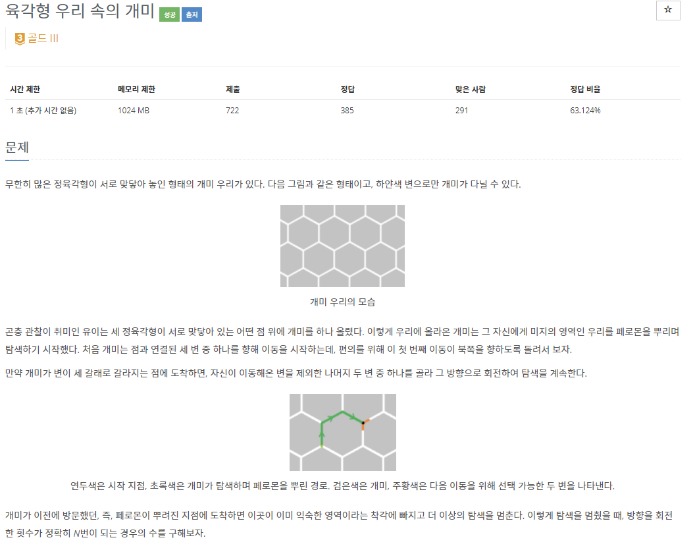
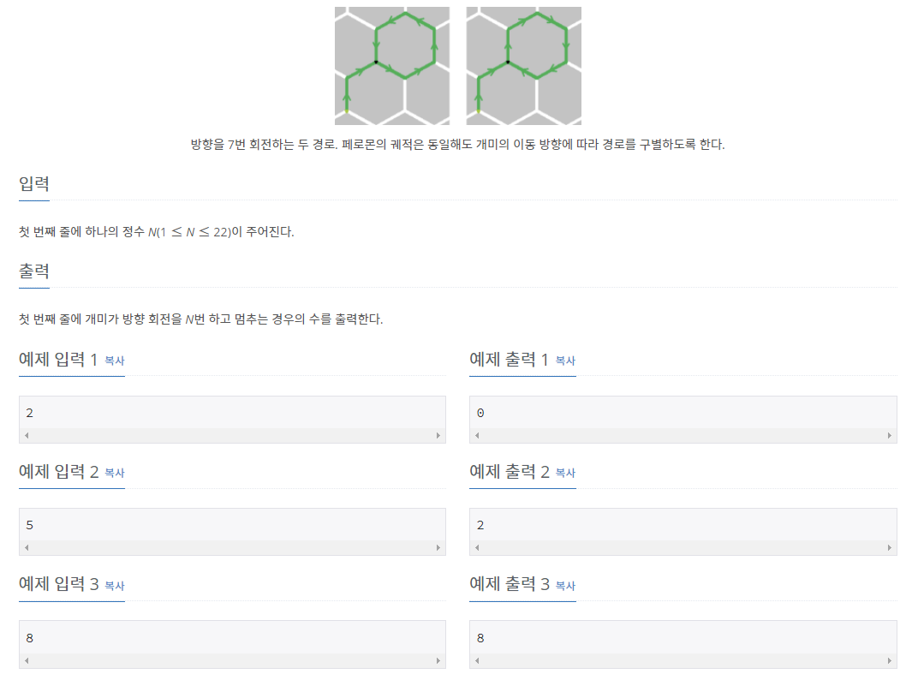

# [[17370] 육각형 우리 속의 개미](https://www.acmicpc.net/problem/17370)



___
## 🤔접근
1. <b>하얀색 변을 좌표화하여 직접 탐색하면서 경우의 수를 구하자</b>
	- 이동할 수 있는 방향은 현재 방향에 따라 다르며, 각각 2방향으로 움직일 수 있고, 방향은 총 6개만 존재한다.
	- 이동한 좌표마다 표시를하고, N번 이동했을 때, 현재 위치가 표시된 위치라면 카운팅 하는 방식으로 구현하자.
___
## 💡풀이
- <b>백트래킹(Backtracking) 알고리즘</b>을(를) 사용하였다.
	- 처음 위치는 방문상태로 체크하고, 위쪽 방향으로 이동시킨 후, DFS을 실시한다.
		- 만약 현재 위치가 이미 방문한 상태라면, return
		- 이동 횟수가 N번에 도달했을 때, 현재 위치가 방문한 상태라면 counting
		- 현재 위치를 방문 상태로 체크하고, 이동가능한 방향으로 이동이 끝나면, 현재 방문 상태를 false로 변경한다(back-track)
		1. 현재 방향이 ↑ 이라면, ↗, ↖ 방향으로 이동 가능
		2. 현재 방향이 ↗ 이라면, ↑, ↘ 방향으로 이동 가능
		3. 현재 방향이 ↘ 이라면, ↓, ↗ 방향으로 이동 가능
		4. 현재 방향이 ↓ 이라면, ↙, ↘ 방향으로 이동 가능
		5. 현재 방향이 ↙ 이라면, ↖, ↓ 방향으로 이동 가능
		6. 현재 방향이 ↖ 이라면, ↙, ↑ 방향으로 이동 가능
___
## ✍ 피드백
___
## 💻 핵심 코드
```c++
void DFS(int n, int row, int col, int dir) {
	if (n == N) {
		if (area[row][col])
			cnt++;
		return;
	}

	if (area[row][col])
		return;
	area[row][col] = true;

	if (dir == UU) {
		DFS(n + 1, row - 1, col + 1, UR);
		DFS(n + 1, row - 1, col - 1, UL);
	}
	else if (dir == UR) {
		DFS(n + 1, row - 1, col, UU);
		DFS(n + 1, row + 1, col + 1, DR);
	}
	else if (dir == DR) {
		DFS(n + 1, row + 1, col, DD);
		DFS(n + 1, row - 1, col + 1, UR);
	}
	else if (dir == DD) {
		DFS(n + 1, row + 1, col + 1, DR);
		DFS(n + 1, row + 1, col - 1, DL);
	}
	else if (dir == DL) {
		DFS(n + 1, row + 1, col, DD);
		DFS(n + 1, row - 1, col - 1, UL);
	}
	else if (dir == UL) {
		DFS(n + 1, row - 1, col, UU);
		DFS(n + 1, row + 1, col - 1, DL);
	}
	area[row][col] = false;
}
```