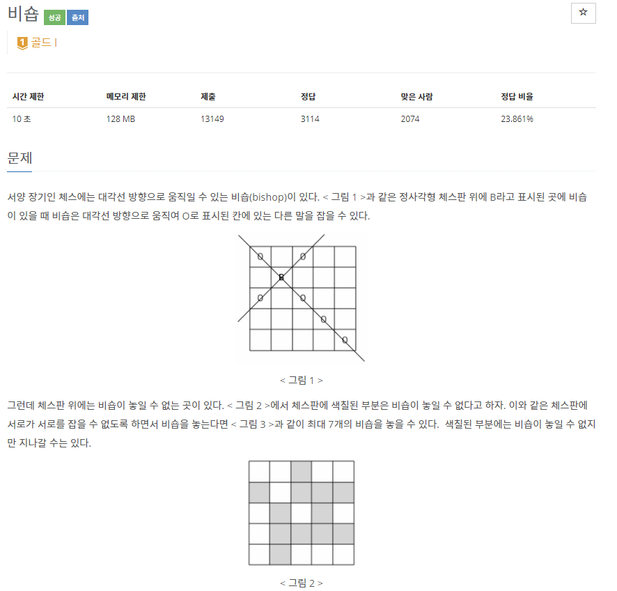
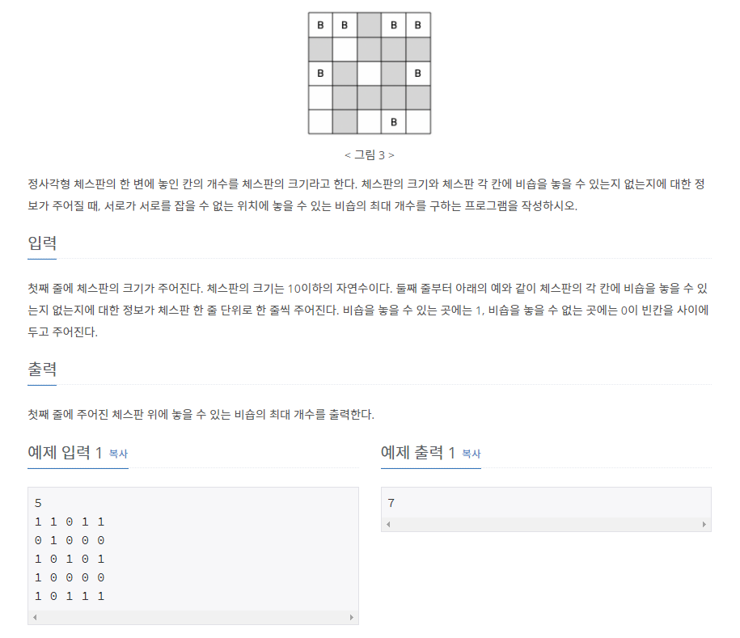

# [[1799] 비숍](https://www.acmicpc.net/problem/1799)



___
## 🤔접근
1. <b>서로 공격을 하지 않는 비숍의 위치를 찾는 방법?</b>
	- 비숍은 대각선 방향으로만 이동하므로, 각 `대각선 방향에 비숍이 없는지 여부`를 확인하면 된다.
	- `\ 방향 대각선`과, `/ 방향 대각선`에 각각 번호를 매기어, 해당 대각선 위치에 비숍의 존재 여부를 저장하자.
	- 위의 정보와 함께 `백트래킹` 알고리즘을 이용하여 모든 경우의 수를 따져, 최대로 놓을 수 있는 비숍의 개수를 구하자.
2. <b>백트래킹을 수행 했을 때, 시간 복잡도는 어떻게 되나?</b>
	- 먼저, 체스판 임의의 위치에 비숍을 놓거나, 안 놓거나의 두 가지 경우가 존재한다.
	- 그러나 비숍을 한 번 놓으면, 해당 위치에서 `대각선 위치`에 있는 지점들에는 비숍을 놓을 수 없다.
	- 그러므로, `비숍을 놓을 수 없는 위치`들은 `한 가지 경우의 수`만 존재한다.
		> 한 가지 경우의 수: 비숍을 놓을 수 없음
	- 즉, 무턱대고 `"비숍을 놓을 수 있는 경우의 수는 2ⁿ'ⁿ개" 라고 생각해서는 안 된다.`
		- 직접 그려가며 경우의 수를 따져본 결과, 체스판에 서로 공격하지 않게 비숍을 최대로 올려 놓았을 때, `비숍을 놓을 수 없는 지점들은 최소 (n * n) / 2개 이상`임을 알아냈다.
		- 즉, `백트래킹` 알고리즘으로 두 가지 경우의 수로 나누어 탐색하는 경우는 최대 `(n * n) / 2개`이므로, 시간 복잡도는 `O(2ⁿ'ⁿ⁄²)`임을 알 수 있다.
			- 결국, 최대 2⁵⁰번 탐색해야 하므로 `시간 초과`이다. (1 ≤ n ≤ 10)
3. <b>시간 복잡도를 더 줄일 수 있는 방법은 없을까?</b>
	- 비숍의 특징 중 하나는 바로 `흑색 칸과 백색 칸의 비숍끼리는 서로 만날 수 없다는 것`이다.
	- 그러므로, 흑색 칸과 백색 칸 각각 따로 백트래킹을 수행하고, 결과를 더함으로써 탐색 시간을 크게 줄일 수 있다.
	- 흑색 칸과 백색 칸은 각각 N / 2칸이므로, 각 백트래킹 시간 복잡도는 `O(2ⁿ'ⁿ⁄⁴)`이다.
		- 이 방법을 이용하면, 최대 `2 * 2²⁵`번 백트래킹을 수행한다. 매우 빠르게 답을 구할 수 있다!
___
## 💡풀이
- <b>백트래킹(Back-tracking) 알고리즘</b>을(를) 사용하였다.
	- `흑색 칸과 백색 칸을 나누어 탐색`해야 하므로, 각 탐색 시작점을 0번째 칸과 1번째 칸으로 설정하고, column 2칸씩 이동하면서 탐색하도록 구현하자.
		- N이 짝수냐 홀수냐에 따라, 마지막 열의 색과 다음 행의 첫 번째 열의 색이 같을 수도, 다를 수도 있다.
			- N이 `짝수`: 마지막 열의 색 = 다음 행의 첫 번째 열의 색
				- 마지막 열에서 다음 행으로 넘어갈 때, `1열`로 이동한다.
			- N이 `홀수`: 마지막 열의 색 ≠ 다음 행의 첫 번째 열의 색
				- 마지막 열에서 다음 행으로 넘어갈 때, `0열`로 이동한다.
	- 현재 위치가 `색칠되지 않은 위치`고, `대각선 방향에 비숍이 없는 경우`, 비숍을 놓고 다음 위치를 탐색한다.
		- `\ 방향` 대각선은 `col - row + N - 1`으로 번호를 매기고, `/ 방향` 대각선은 `row + col`으로 번호를 매기자.
	- 모든 체스판을 탐색하였으면, 현재 탐색하는 색의 최대 놓을 수 있는 비숍의 개수를 갱신한다.
__
## ✍ 피드백
___
## 💻 핵심 코드
```c++
int main(){
	...
	DFS(0, 0, 0, BLACK);
	DFS(0, 1, 0, WHITE);
	cout << ans[0] + ans[1];
}

void DFS(int row, int col, int cnt, int color) {
	if (col >= N) {
		if (col % 2 == 0)
			col = 1;
		else
			col = 0;
		row++;
	}
	if (row == N) {
		ans[color] = max(ans[color], cnt);
		return;
	}

	if (chess[row][col] && !leftDiagonal[col - row + N - 1] && !rightDiagonal[row + col]) {
		leftDiagonal[col - row + N - 1] = rightDiagonal[row + col] = true;
		DFS(row, col + 2, cnt + 1, color);
		leftDiagonal[col - row + N - 1] = rightDiagonal[row + col] = false;
	}
	DFS(row, col + 2, cnt, color);
}
```