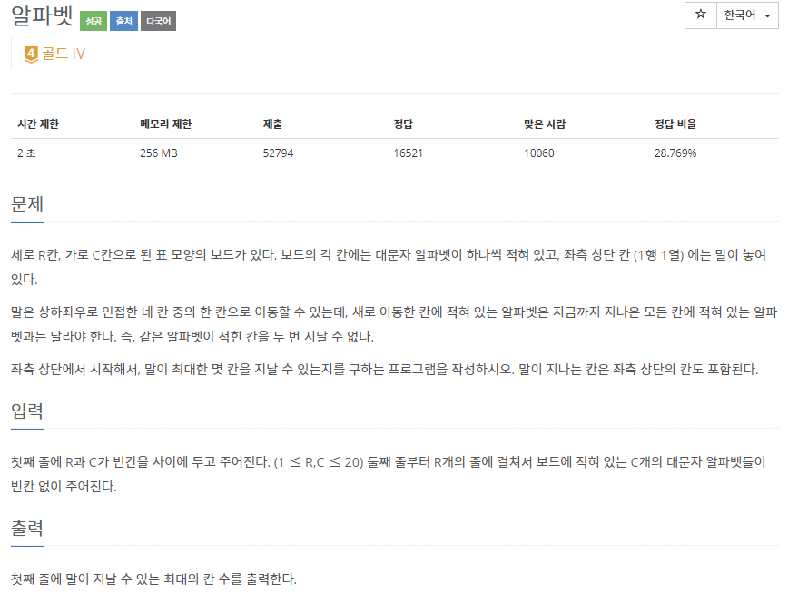
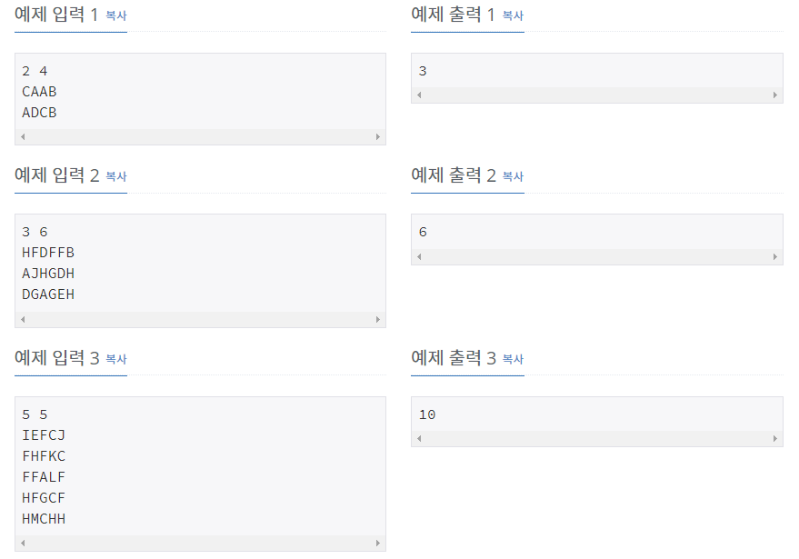

# [[1987] 알파벳](https://www.acmicpc.net/problem/1987)



___
## 🤔접근
1. <b>이미 지나간 알파벳 자리는 지나가지 않으면서, 가장 많은 칸을 지날 수 있는 경우의 수 찾기</b>
	- 백트래킹 알고리즘으로 해결하자.
	- 중복 여부는 어떻게 체크할까?
		1. unordered_set
		2. 비트마스킹 or bool형 배열
___
## 💡풀이
- <b>백트래킹(Back-Tracking) 알고리즘</b>을(를) 사용하였다.
__
## ✍ 피드백
1. <b>중복 여부 체크는 비트마스킹 or bool형 배열로 하는 것이 효율적이다.</b>
	- 처음에는 set 자료구조를 이용하여 체크했지만, 시간 초과를 받았다.
___
## 💻 핵심 코드
```c++
void DFS(int n, int row, int col) {
	if (n > cnt)
		cnt = n;

	for (int i = 0; i < 4; i++) {
		int newRow = row + dr[i];
		int newCol = col + dc[i];

		if (newRow < 0 || newCol < 0 || newRow >= R || newCol >= C)
			continue;
		if (alphabet[board[newRow][newCol] - 'A'] == true)
			continue;

		alphabet[board[newRow][newCol] - 'A'] = true;
		DFS(n + 1, newRow, newCol);
		alphabet[board[newRow][newCol] - 'A'] = false; // back-tracking
	}
}
```