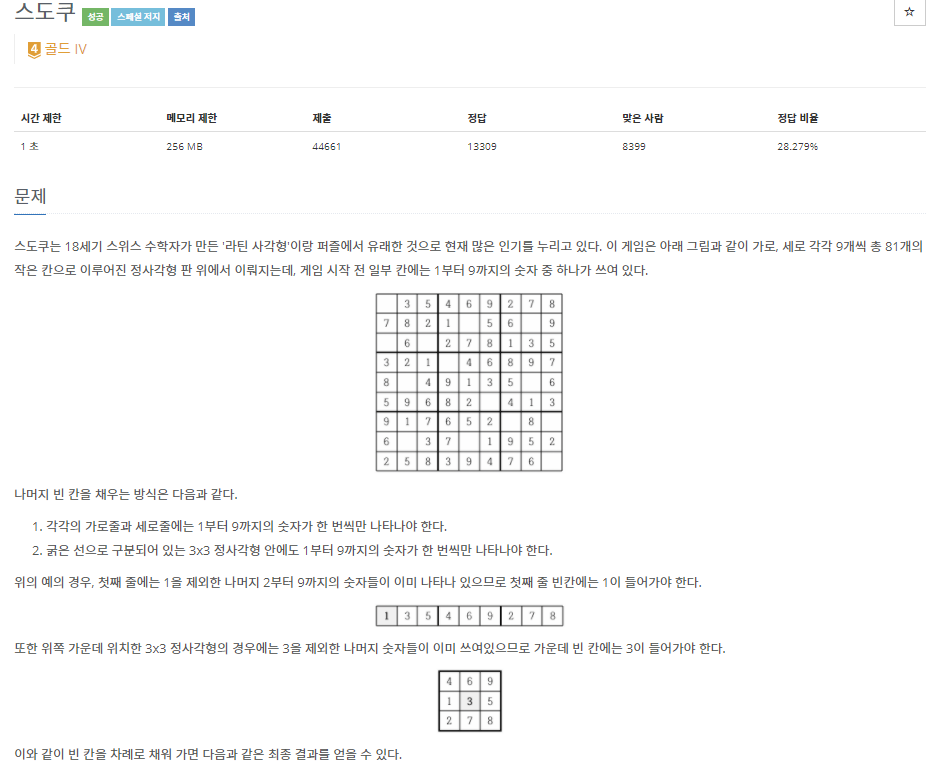
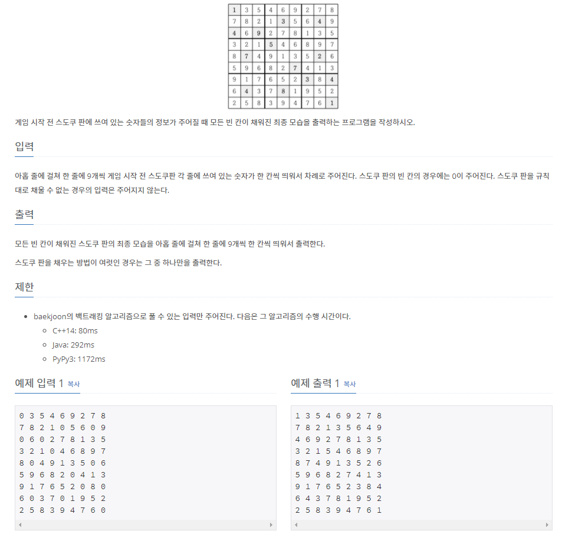

# [[2580] 스도쿠](https://www.acmicpc.net/problem/2580)



___
## 🤔접근
1. <b>아래의 스도쿠 조건을 만족하면서 빈칸에 숫자를 채워나가야 한다.</b>
	- 각각의 가로줄과 세로줄에는 1부터 9까지의 숫자가 한 번씩만 나타나야 한다.
	- 굵은 선으로 구분되어 있는 3x3 정사각형 안에도 1부터 9까지의 숫자가 한 번씩만 나타나야 한다.
___
## 💡풀이
- <b>Backtracking 알고리즘</b>을(를) 사용하였다.
	- 각 행, 열, 3x3 정사각형마다 1~9 숫자가 존재하는지에 대한 정보를 관리해야 한다.
		- `rows[행][숫자]`, `cols[열][숫자]`, `sqr[정사각형][숫자]`
	- (0, 0)부터 탐색하며, 탐색 중인 (행, 열)이 빈칸(숫자 0)인 경우
		- 가로, 세로, 현재 위치의 정사각형에서 공통으로 없는 숫자를 현재 (행, 열)에 입력한다.
	- 스도쿠 판을 모두 채운 경우, `exit(0)`을 호출하여 프로그램을 종료시켜야 한다.
		- 하나의 결과만 얻으면 되기 때문

___
## ✍ 피드백
___
## 💻 핵심 코드
```c++
void DFS(int N) {
	if (N == MAX)
		print();
	
	int row = N / SIZE;
	int col = N % SIZE;

	if (sudoku[row][col])
		DFS(N + 1);
	else {
		for (int i = 1; i <= SIZE; i++) {
			if (rows[row][i] && cols[col][i] && sqr[changeToSquareIdx(row, col)][i]) {
				// dfs
				sudoku[row][col] = i;
				rows[row][i] = cols[col][i] = sqr[((row / 3) * 3) + (col / 3)][i] = false;
				DFS(N + 1);
				// back-tracking
				sudoku[row][col] = 0;
				rows[row][i] = cols[col][i] = sqr[((row / 3) * 3) + (col / 3)][i] = true;
			}
		}
	}
}
```