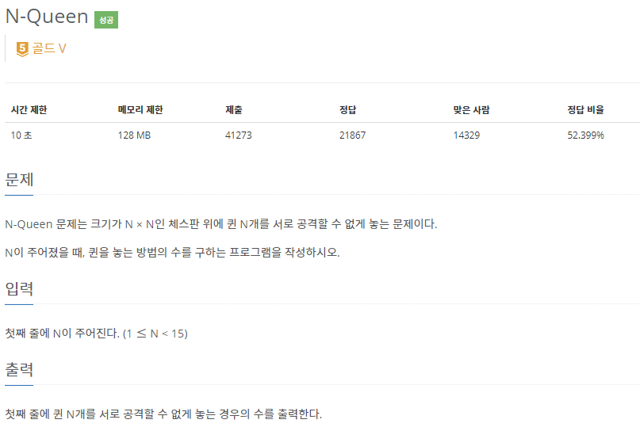
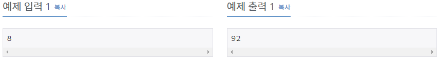

# [[9663] N-Queen](https://www.acmicpc.net/problem/9663)



___
## 🤔접근
1. <B>N x N 체스판에서 Queen N개를 서로 공격할 수 없게 두어야 한다.</B>
	- Queen은 가로, 세로, 대각선으로 원하는 만큼 이동할 수 있다.
	- 이러한 특성을 이용하여 Queen을 배치할 수 있는 위치를 제한하여, 배치할 수 있는 총 경우의 수를 구하자.
___
## 💡풀이
- <b>Backtracking 알고리즘</b>을(를) 사용하였다.
	- 1번째 row부터 N번째 row까지 Queen을 1번째~N번쨰 column에 각각 놓을 수 있는지 여부를 확인한다.
	- Queen은 가로, 세로, 대각선으로 원하는 만큼 이동가능하다.
		- 가로: 각 coulumn에 한 번씩 놓아보기 때문에 따로 제한할 필요 없음
		- 세로: 1번째 row부터 현재 row까지 놓여진 Queen의 column을 확인
		- 대각선: 1번째 row부터 현재 row까지 놓여진 Queen과 현재 Queen의 (row, column)의 차를 확인
			> ex) 
			> - 각각 (1,1) (2,2)이면, (row, column) 차이 1로 같으므로 대각선에 놓여져 있음
			> - 각각 (1,1) (2,3)이면, (row, column) 차이가 다르므로 대각선에 놓여져 있지 않음

___
## ✍ 피드백
___
## 💻 핵심 코드
```c++
bool checkValid(int row, int col) {
	for (int r = 1; r < row; r++) {
		if (columns[r] == col)
			return false;
		if (abs(r - row) == abs(columns[r] - col))
			return false;
	}
	return true;
}

void DFS(int row) {	
	if (row == N + 1) {
		cnt++;
		return;
	}

	for (int col = 1; col <= N; col++) {
		if (checkValid(row, col)) {
			columns[row] = col;
			DFS(row + 1);
		}
	}
}
```