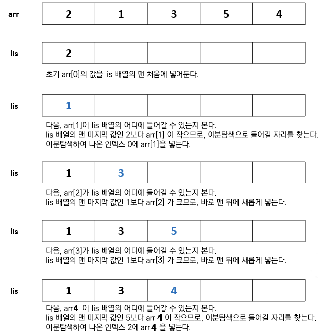

# 최장 증가 부분 수열(LIS, Longest Increasing Subsequence) 알고리즘

## LIS(Longest Increasing Subsequence) Algorithm
### 📖개념	
- <b>원소가 n개인 수열에서 `오름차순으로 정렬된 가장 긴 부분 수열`을 구하는 알고리즘</b>
### ✅특징
- <b>구현 방법</b>
	- 완전 탐색, DP, 이분 탐색
	- 가장 최적화된 방법은 `⭐이분 탐색⭐` 알고리즘을 이용하는 것이다.
- <b>원리</b>
	- 
	- 위의 방법으로 `LIS의 길이`는 구할 수 있지만, LIS 배열에 있는 부분 수열은 진짜 LIS가 아니다.
		- 진짜 LIS을 구하려면 추가적인 작업이 필요하다.
			- arr 배열에 `각 원소까지의 LIS 길이`를 추가로 저장해야 한다.
			- arr 배열의 끝에서부터 거꾸로 탐색하면서,<br>수열의 최대 LIS의 길이에 해당하는 원소부터 LIS 길이가 1인 원소까지 내림차순으로 하나씩 선택하고,<br>끝으로 선택한 부분 수열의 순서를 뒤집으면 실제 LIS를 구할 수 있다.
- <b>시간 복잡도</b>
	- `O(N * logN)`
- <b>대표 사례</b>
	- 주어진 연결된 전선 정보를 토대로, 연결 상태가 꼬이지 않도록 최소의 전선을 제거하는 방법 찾기 
	- LIS을 오름차순으로 출력하기
	- LIS를 만들 수 있는 경우의 수 구하기
### 💻구현
```c++
vector<int> findLIS(int n) {
	vector<int> LIS;
	vector<pair<int, int>> arr(n); // <element, length of LIS>
	for (int i = 0; i < n; i++)
		cin >> arr[i].first;

	for (int i = 0; i < n; i++) {
		int idx = lower_bound(LIS.begin(), LIS.end(), arr[i].first) - LIS.begin();
		if (LIS.empty() || LIS.back() < arr[i].first)
			LIS.push_back(arr[i].first);
		else
			LIS[idx] = arr[i].first;
		arr[i].second = idx;
	}

	stack<int> s;
	int len = LIS.size() - 1;
	for (int i = n - 1; i >= 0; i--) {
		if (arr[i].second == len) {
			s.push(arr[i].first);
			if (--len < 0)
				break;
		}
	}

	LIS.clear();
	LIS.resize(s.size());
	for (int i = 0; i < LIS.size(); i++) {
		LIS[i] = s.top(); s.pop();
	}
	return LIS;
}
```
___
