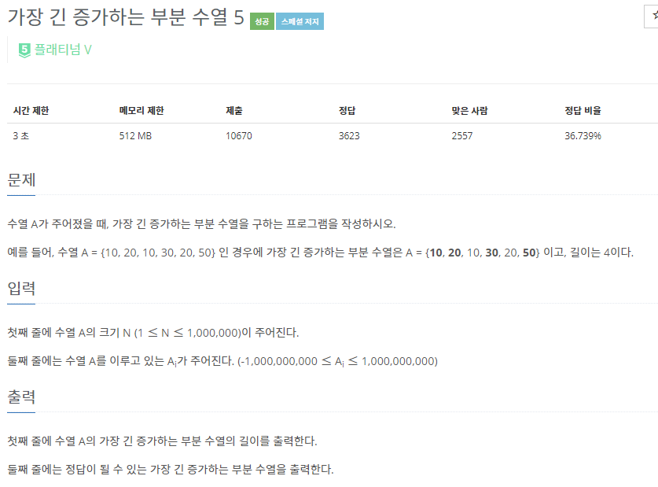
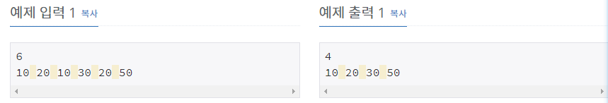

# [[14003] 가장 긴 증가하는 부분 수열 5](https://www.acmicpc.net/problem/14003)



___
## 🤔접근
___
## 💡풀이
- <B>알고리즘 & 자료구조</B>
	- `LIS(Longest Increasing Subsequence)`
	- 스택(Stack)
- <b>구현</b>
	- 입력 받은 수열을 순차 탐색하면서 아래의 작업을 진행하였다.
		- LIS 배열이 empty이거나, 맨 끝 원소보다 크다면, LIS 배열에 현재 원소 삽입
		- 위의 두 경우가 모두 아니라면, LIS 배열에서 현재 원소가 들어갈 위치를 이분 탐색하여 교체
	- 위의 방식으로는 실제 LIS 부분 수열을 구할 수 없다. 단지 LIS의 최대 길이만 구할 수 있다.
	- 실제 LIS를 구하려면 추가 작업이 필요하다.
		- 입력 받은 수열의 수마다 해당 위치까지의 LIS를 저장하였다.
		- 위의 작업이 모두 끝나면, 아래의 작업을 수행하였다.
			- 먼저, LIS의 최대 길이를 변수 n에 저장하였다.
			- 수열 끝에서부터 거꾸로 탐색하면서 n에 해당하는 수를 스택에 push하고, n을 1 감소시켰다.
			- 위 작업을 n이 -1이 될 때까지 반복하였다.
		- 다음으로, 스택에서 하나씩 pop해보면, 실제 LIS의 부분 수열을 구할 수 있다.
___
## ✍ 피드백
___
## 💻 핵심 코드
```c++
int main() {
	...

	for (int i = 0; i < N; i++) {
		int idx = lower_bound(LIS.begin(), LIS.end(), v[i].first) - LIS.begin();
		if (LIS.empty() || LIS.back() < v[i].first) 
			LIS.push_back(v[i].first);
		else 
			LIS[idx] = v[i].first;
		v[i].second = idx;
	}

	stack<int> s;
	int n = LIS.size() - 1;
	for (int i = N - 1; i >= 0; i--) {
		if (v[i].second == n) {
			s.push(v[i].first);
			if (--n < 0)
				break;
		}
	}

	cout << LIS.size() << '\n';
	while (!s.empty()) {
		cout << s.top() << ' ';
		s.pop();
	}

	...
}
```