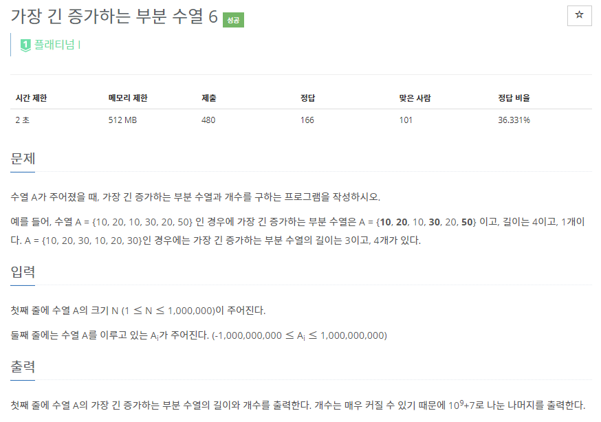
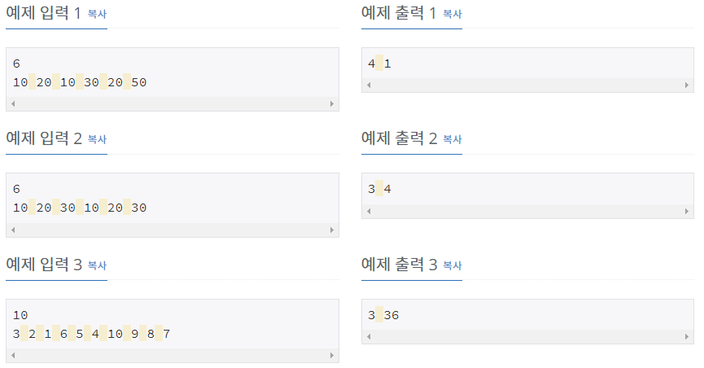

# [[17411] 가장 긴 증가하는 부분 수열 6](https://www.acmicpc.net/problem/17411)



___
## 🤔접근
___
## 💡풀이
- <B>알고리즘 & 자료구조</B>
	- `LIS(Longest Increasing Subsequence)`
- <b>구현</b>
	- `LIS의 길이`를 구하기 위해 입력 받은 수열을 순차 탐색하면서 아래의 작업을 진행하였다.
		- LIS 배열이 empty이거나, 맨 끝 원소보다 크다면, LIS 배열에 현재 원소 삽입
		- 위의 두 경우가 모두 아니라면, LIS 배열에서 현재 원소가 들어갈 위치를 이분 탐색하여 교체
	- 위의 방식으로는 실제 LIS 부분 수열을 구할 수 없다. 단지 LIS의 최대 길이만 구할 수 있다.
	- `실제 LIS`를 구하려면 추가 작업이 필요하다.
		- 입력 받은 수열의 수마다 해당 위치까지의 LIS를 저장하였다.
	- 또한, `LIS의 개수`를 구하기 위해 아래의 추가 작업이 필요하다.
		- 각 숫자의 LIS의 길이에 해당하는 숫자들을 보관하는 `num 배열`을 만들었다.
			- 수열을 반대로 탐색할 예정이므로, 오름차순으로 저장이 된다.
		- 각 숫자의 LIS의 개수를 저장하는 `cnt 배열`을 만들었다.
		- 수열의 끝에서부터 반대로 탐색하며 다음의 작업을 수행하였다.
			- num 배열에 숫자를 오름차순으로 저장한다.
			- 현재 원소의 LIS가 최대 LIS라면, cnt 배열에 1씩 더한다.
			- 현재 원소의 LIS가 최대 LIS가 아니라면, cnt 배열에 len+1 길이의 cnt 만큼 더한다.
				- 예를 들어, `3 2 1 2`처럼, 숫자가 크더라도 위치에 따라 LIS 길이가 작을 수도 있으므로, len+1 길이의 num 배열에 현재 원소의 위치에 해당하는 index를 가져와서 len+1 길이의 cnt 배열에서 index 번째에 위치하는 개수를 추가로 빼주어야 한다.
				- 이 때, 모듈러 연산으로 인해 값이 음수가 저장될 수 있으므로, 추가로 MOD를 더해준 값에 모듈러 연산을 해주어야 한다.
		

___
## ✍ 피드백
___
## 💻 핵심 코드
```c++
int main() {
	...

	vector<pair<int, int>> v(N);
	for (int i = 0; i < N; i++)
		cin >> v[i].first;

	vector<int> LIS;
	vector<vector<long long>> num(N + 1), cnt(N + 1, vector<long long>(1, 0));
	for (int i = 0; i < N; i++) {
		int idx = lower_bound(LIS.begin(), LIS.end(), v[i].first) - LIS.begin();
		if (LIS.empty() || LIS.back() < v[i].first) 
			LIS.push_back(v[i].first);
		else 
			LIS[idx] = v[i].first;
		v[i].second = idx + 1;
	}

	int lenLIS = LIS.size();
	for (int i = N - 1; i >= 0; i--) {
		int curLenCnt, len = v[i].second;

		if (len == lenLIS)
			curLenCnt = 1;
		else {
			int idx = upper_bound(num[len + 1].begin(), num[len + 1].end(), v[i].first) - num[len + 1].begin();
			curLenCnt = (cnt[len + 1].back() - cnt[len + 1][idx] + MOD) % MOD;
		}

		num[len].push_back(v[i].first);
		cnt[len].push_back((curLenCnt + cnt[len].back()) % MOD);
	}

	cout << lenLIS << ' ' << cnt[1].back();

	...
}
```