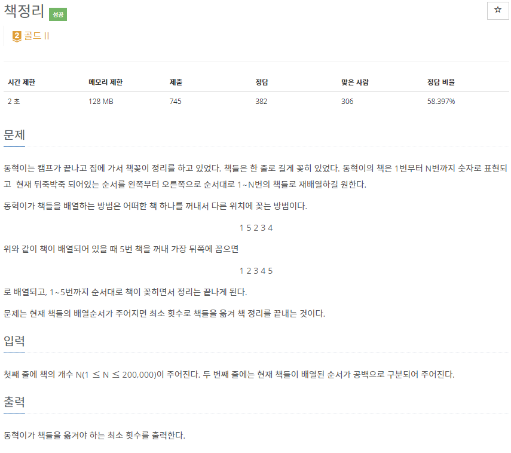
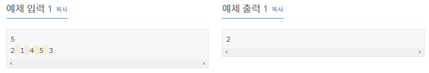

# [[1818] 책정리](https://www.acmicpc.net/problem/1818)



___
## 🤔접근
1. <b>가장 길게 오름차순으로 정렬되어 있는 책을 제외한 나머지 책들을 재배치하는 방법이 최소로 책을 옮기는 방법이다.</b>
	- LIS 알고리즘으로 LIS의 길이를 알아내고, 책의 총 개수에서 빼면 답을 구할 수 있다.
___
## 💡풀이
- <B>알고리즘 & 자료구조</B>
	- `LIS(Longest Increasing Subsequence)`
- <b>구현</b>
	- `LIS의 길이`를 구하기 위해 입력 받은 수열을 순차 탐색하면서 아래의 작업을 진행하였다.
		- LIS 배열이 empty이거나, 맨 끝 원소보다 크다면, LIS 배열에 현재 원소 삽입
		- 위의 두 경우가 모두 아니라면, LIS 배열에서 현재 원소가 들어갈 위치를 이분 탐색하여 교체
___
## ✍ 피드백
___
## 💻 핵심 코드
```c++
int main() {
	...

	vector<int> LIS;
	for (int i = 0; i < N; i++) {
		if (LIS.empty() || LIS.back() < v[i])
			LIS.push_back(v[i]);
		else {
			int idx = lower_bound(LIS.begin(), LIS.end(), v[i]) - LIS.begin();
			LIS[idx] = v[i];
		}
	}
	cout << N - LIS.size();

	...
}
```