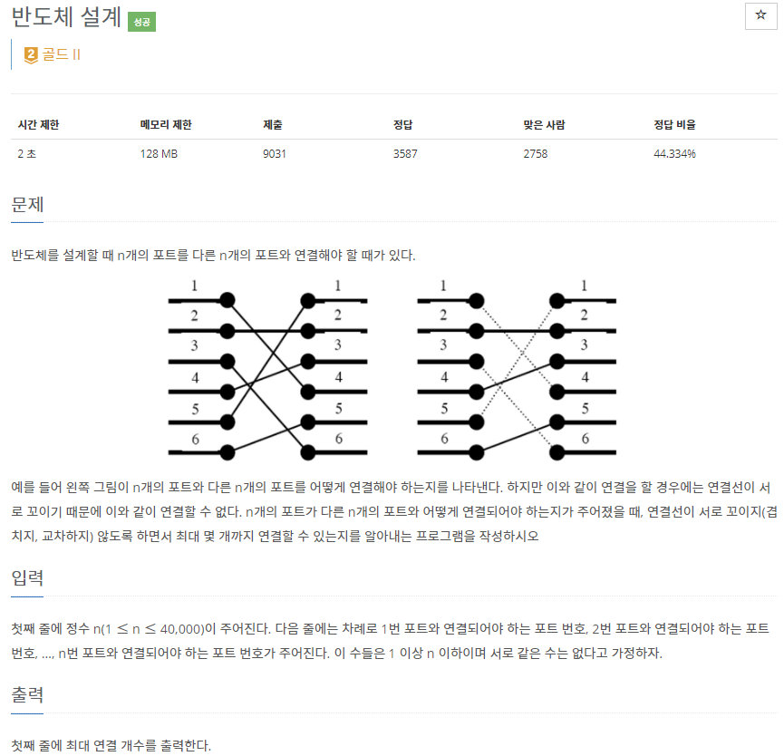
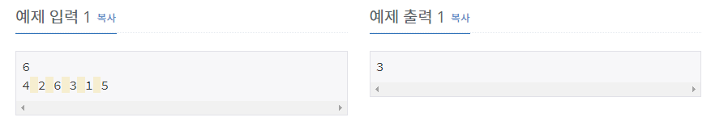

# [[2352] 반도체 설계](https://www.acmicpc.net/problem/2352)



___
## 🤔접근
1. <b>연결선이 서로 꼬이지 않도록 최대로 연결하는 방법은 다음과 같다.</b>
	- 왼쪽 포트를 번호 오름차순으로 순서대로 연결할 때, `i-1번째 포트가 연결한 오른쪽 포트 번호 > i번째 포트가 연결한 오른쪽 포트 번호`이면 꼬인 경우이다.
	- 즉, 왼쪽 포트에서 오른쪽 포트를 오름차순으로 연결하면 최대로 연결할 수 있다.
___
## 💡풀이
- <B>알고리즘 & 자료구조</B>
	- `LIS(Longest Increasing Subsequence)`
- <b>구현</b>
	- 왼쪽 포트에서 연결한 오른쪽 포트 번호를 오름차순으로 left 배열에 저장하였다.
	- left 배열을 순차 탐색하면서, `LIS 배열이 비어있거나, LIS 배열의 끝 원소가 < 현재 left 배열의 원소`이면 LIS 배열의 끝에 추가하였다.
		- 위의 두 경우에 모두 해당하지 않으면, `LIS 배열을 이분 탐색`했을 때, 현재 left 배열의 원소가 들어갈 위치를 찾고, 원소를 swap하였다.
___
## ✍ 피드백
___
## 💻 핵심 코드
```c++
int main() {
	...

	for (int i = 1; i <= n; i++) {
		if (LIS.empty() || LIS.back() < left[i])
			LIS.push_back(left[i]);
		else {
			int idx = lower_bound(LIS.begin(), LIS.end(), left[i]) - LIS.begin();
			LIS[idx] = left[i];
		}
	}
	cout << LIS.size();

	...
}
```