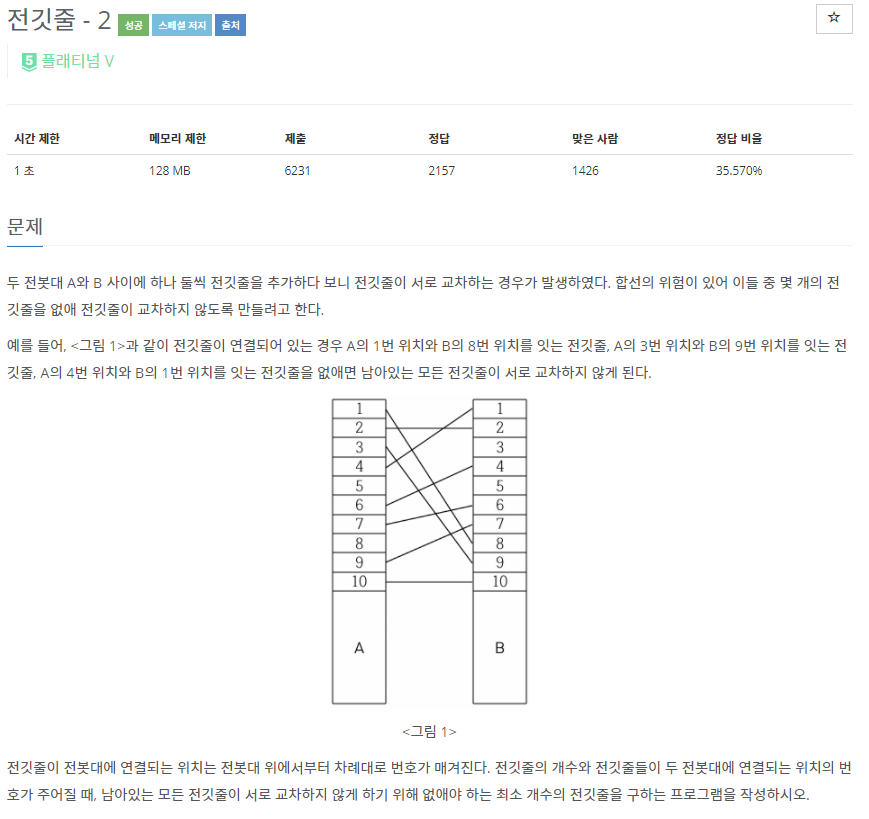
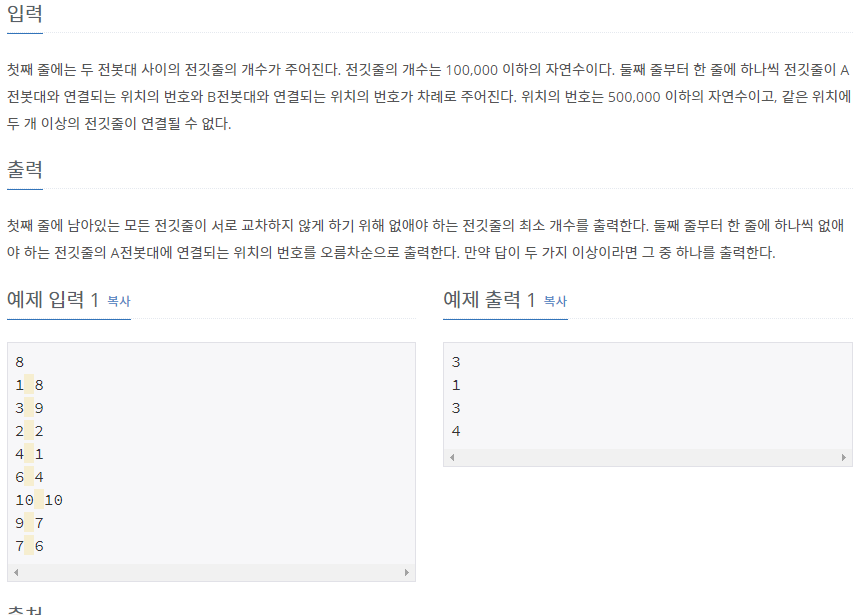

# [[2568] 전깃줄 - 2](https://www.acmicpc.net/problem/2568)



___
## 🤔접근
1. <b>전깃줄 입력이 500,000 이하의 자연수로 랜덤으로 들어오므로, 미리 만들어 놓자.</b>
	- 입력받지 않은 전깃줄은 NONE 상태로, 탐색 시 continue
2. <b>전깃줄이 교차하지 않게 없애는 최소 갯수는 전깃줄의 개수에서 LIS의 길이를 빼주면 구할 수 있다.</b>
3. <b>제거해야 하는 전깃줄의 번호도 출력해야 하므로, 실제 LIS도 구해야 한다.</b>
___
## 💡풀이
- <B>알고리즘 & 자료구조</B>
	- `LIS(Longest Increasing Subsequence)`
- <b>구현</b>
	- `LIS의 길이`를 구하기 위해 입력 받은 수열을 순차 탐색하면서 아래의 작업을 진행하였다.
		- LIS 배열이 empty이거나, 맨 끝 원소보다 크다면, LIS 배열에 현재 원소 삽입
		- 위의 두 경우가 모두 아니라면, LIS 배열에서 현재 원소가 들어갈 위치를 이분 탐색하여 교체
	- 위의 방식으로는 실제 LIS 부분 수열을 구할 수 없다. 단지 LIS의 최대 길이만 구할 수 있다.
	- `실제 LIS`를 구하려면 추가 작업이 필요하다.
		- 입력 받은 수열의 수마다 해당 위치까지의 LIS를 저장하였다.
		- 위의 작업이 모두 끝나면, 아래의 작업을 수행하였다.
			- 먼저, LIS의 최대 길이를 변수 n에 저장하였다.
			- 수열 끝에서부터 거꾸로 탐색하면서 n에 해당하는 수를 찾으면, n을 1 감소시켰다.
			- 위 작업을 n이 -1이 될 때까지 반복하였다.
	- 하지만, 구해야 하는 것은 실제 LIS에 포함되지 않는 다른 전깃줄들의 번호이므로, 이를 제외한 나머지를 모아 오름차순으로 정렬하여 출력하였다.
___
## ✍ 피드백
___
## 💻 핵심 코드
```c++
int main() {
	...

	vector<pair<int, int>> v(5e5 + 1, {NONE, NONE});
	for (int i = 0; i < N; i++) {
		int n1, n2;
		cin >> n1 >> n2;
		v[n1].first = n2;
	}

	vector<int> LIS;
	for (int i = 1; i <= 5e5; i++) {
		if (v[i].first == NONE)
			continue;

		int idx = lower_bound(LIS.begin(), LIS.end(), v[i].first) - LIS.begin();
		if (LIS.empty() || LIS.back() < v[i].first)
			LIS.push_back(v[i].first);
		else 
			LIS[idx] = v[i].first;
		v[i].second = idx;
	}
	
	vector<int> ans;
	int n = LIS.size() - 1;
	for (int i = 5e5; i >= 1; i--) {
		if (v[i].first == NONE)
			continue;

		if (n >= 0 && v[i].second == n)
			n--;
		else
			ans.push_back(i);
	}
	sort(ans.begin(), ans.end());
	cout << N - LIS.size() << '\n';
	for (int a : ans)
		cout << a << '\n';

	...
}
```