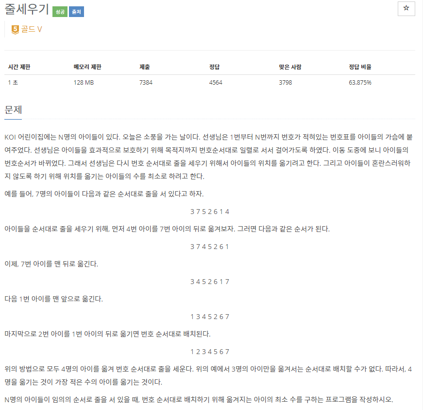
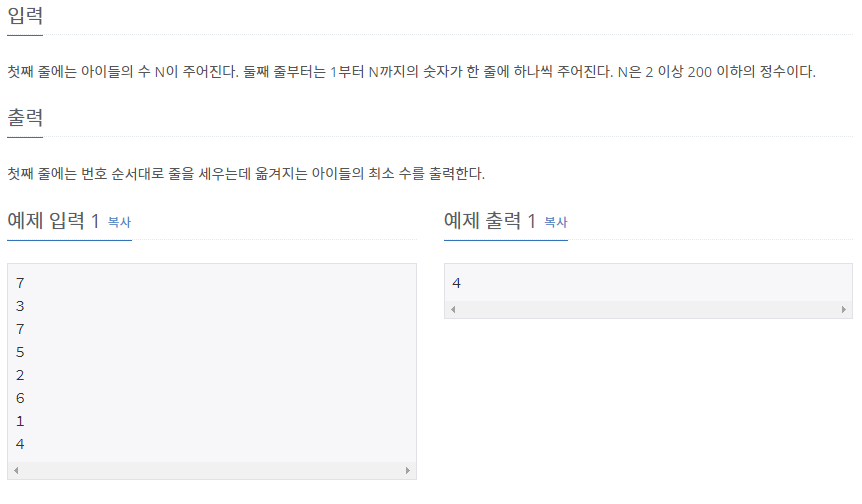

# [[2631] 줄세우기](https://www.acmicpc.net/problem/2631)



___
## 🤔접근
- 번호 오름차순으로 세우기 위해, 최소의 위치 이동 방법을 알아내야 한다.
	- LIS를 제외한 나머지 번호를 이동시키는 것이 가장 최소로 이동시키는 방법이다.
___
## 💡풀이
- <B>알고리즘 & 자료구조</B>
	- `LIS`
- <b>구현</b>
	- N - LIS 길이로 답을 구할 수 있다.
___
## ✍ 피드백
___
## 💻 핵심 코드
```c++
int main(){
	...
    for (int i = 0; i < N; i++) {
        if (LIS.empty() || LIS.back() < v[i])
            LIS.push_back(v[i]);
        else {
            int idx = lower_bound(LIS.begin(), LIS.end(), v[i]) - LIS.begin();
            LIS[idx] = v[i];
        }
    }

    cout << N - LIS.size();
	...
}
```