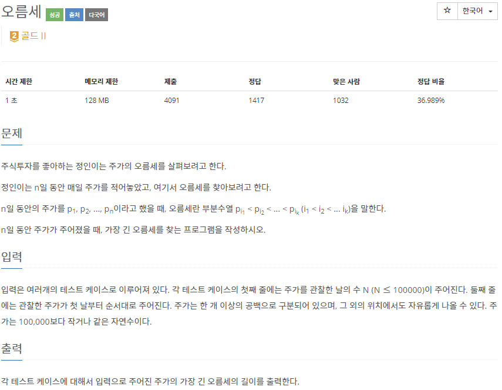
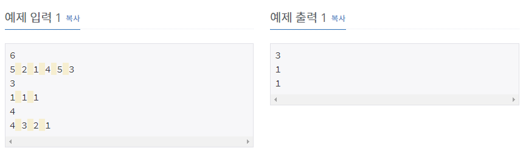

# [[3745] 오름세](https://www.acmicpc.net/problem/3745)



___
## 🤔접근
___
## 💡풀이
- <B>알고리즘 & 자료구조</B>
	- `LIS(Longest Increasing Subsequence)`
- <b>구현</b>
	- `LIS의 길이`를 구하기 위해 입력 받은 수열을 순차 탐색하면서 아래의 작업을 진행하였다.
		- LIS 배열이 empty이거나, 맨 끝 원소보다 크다면, LIS 배열에 현재 원소 삽입
		- 위의 두 경우가 모두 아니라면, LIS 배열에서 현재 원소가 들어갈 위치를 이분 탐색하여 교체
___
## ✍ 피드백
___
## 💻 핵심 코드
```c++
int main() {
	...

	while (cin >> N) {
		vector<int> v(N);
		for (int i = 0; i < N; i++)
			cin >> v[i];
		vector<int> LIS;
		for (int i = 0; i < N; i++) {
			int idx = lower_bound(LIS.begin(), LIS.end(), v[i]) - LIS.begin();
			if (LIS.empty() || LIS.back() < v[i])
				LIS.push_back(v[i]);
			else
				LIS[idx] = v[i];
		}
		cout << LIS.size() << '\n';
	}

	...
}
```