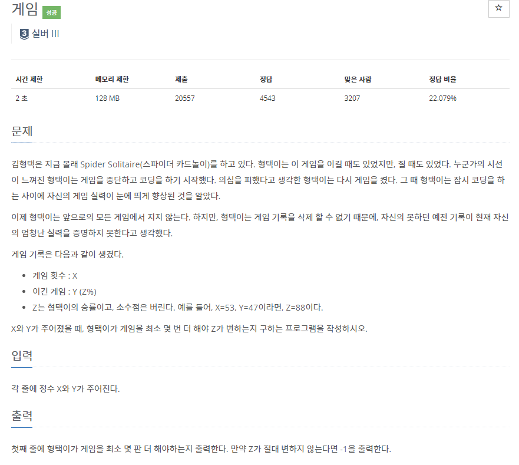
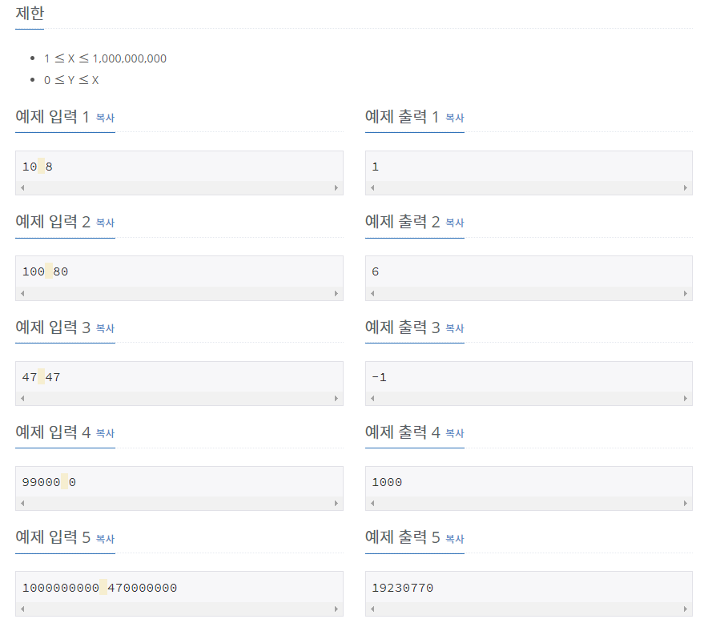

# [[1072] 게임](https://www.acmicpc.net/problem/1072)



___
## 🤔접근
1. <b>승률이 1% 오르기 위해 몇 번 이겨야 하는지 알아내야 한다.</b>
	- 게임 횟수가 최대 10억번이므로, 승률을 1% 올리기 위해 최대 약 1천만번을 이겨야 할 수도 있다.
	- 1씩 더하면서 구하는 것은 오래 걸리므로, 이분 탐색을 이용하자.
___
## 💡풀이
- <B>알고리즘 & 자료구조</B>
	- `이분 탐색(Binary Search)`
- <b>구현</b>
	- 이분 탐색을 하면서 아래와 같이 진행하였다.
		- 승률이 오르는 경우: `high = mid - 1`
			- 여기서 최소 게임 횟수를 갱신하였다.
			- `ans = mid`
		- 승률이 오르지 않는 경우: `low = mid + 1`
___
## ✍ 피드백
___
## 💻 핵심 코드
```c++
int main() {
	...

	while (low <= high) {
		mid = (low + high) / 2;
		int newP = (100 * (Y + mid)) / (X + mid);
		if (newP > p) {
			high = mid - 1;
			ans = mid;
		}
		else 
			low = mid + 1;
	}

	cout << (p >= 99 ? -1 : ans);

	...
}
```