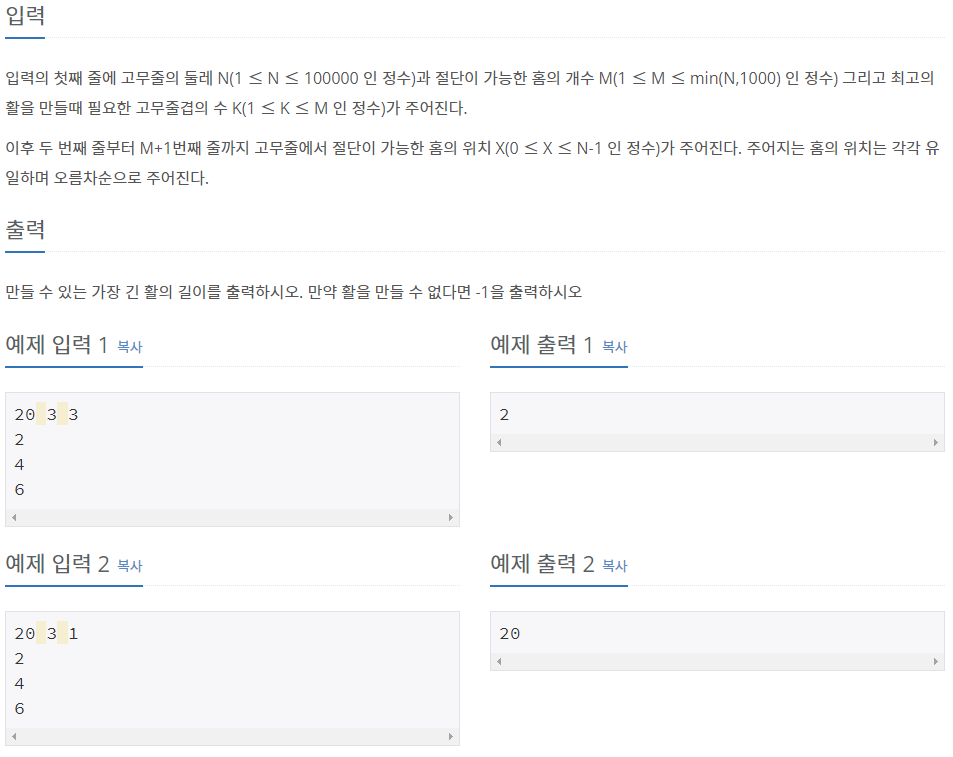

# [[15790] 최종병기 활](https://www.acmicpc.net/problem/15790)



___
## 🤔접근

___
## 💡풀이
- <b>알고리즘 & 자료구조</b>
	- `이분 탐색`
- <b>구현</b>
	- 이분 탐색으로 만들 수 있는 가장 긴 활의 길이를 찾는다.
		- 각 홈을 한 번씩 시작지점으로 잡은 다음 아래의 결과에 따라 범위를 다르게 좁혀나갔다.
			- 두 홈 간의 길이가 `mid 이상`인 개수가 `K개 이상`이라면, 활의 길이를 더 길게 만들어 본다.
			- 그렇지 않다면, 활의 길이를 더 짧게 만들어 본다.
___
## ✍ 피드백
___
## 💻 핵심 코드
```c++
bool isPossible(const vector<int>& pos, int src, int len, int cnt) {
	int cur = src;
	int next = (src + 1) % M;

	while (src != next) {
		if ((pos[next] - pos[cur] + N) % N >= len) { // 두 홈 간의 길이가 len 이상인지 확인
			cur = next;
			if (++cnt == K) // 마지막 홈에서 처음 홈까지 길이가 len 이상인지 확인
				return ((pos[src] - pos[cur] + N) % N >= len ? true : false);
		}
		next = (next + 1) % M;
	}

	return false;
}

int main() {
	...

	cin >> N >> M >> K; // 고무줄 둘레, 절단 가능한 홈의 개수, 필요한 고무줄 겹 수

	vector<int> pos(M); // 고무줄 파인 홈의 위치
	for (int i = 0; i < M; i++)
		cin >> pos[i];

	if (K == 1)
		cout << N;
	else {
		int low = 1, high = N;

		while (low <= high) { // 이분 탐색으로 만들 수 있는 가장 긴 활의 길이 찾기
			int mid = (low + high) / 2; // 활의 길이
			bool flag = false;

			// 모든 홈을 각각 시작 홈으로 설정 -> 가장 왼쪽(처음) 홈을 찾기 위함
			for (int i = 0; i < M; i++) {
				// 길이가 mid인 K개의 고무줄을 만들 수 있는지 확인
				if (isPossible(pos, i, mid, 1)) {
					flag = true;
					break;
				}
			}

			flag ? low = mid + 1 : high = mid - 1;
		}

		cout << high;
	}

	...
}
```