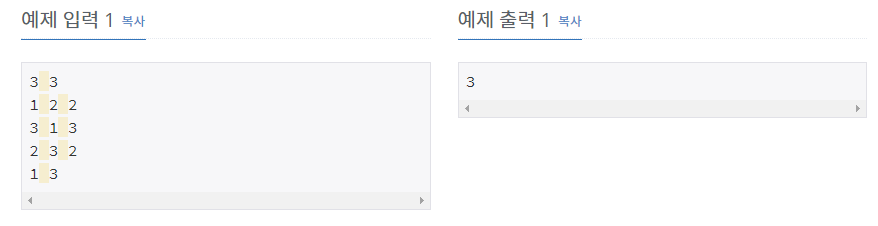

# [[1939] 중량제한 ](https://www.acmicpc.net/problem/1939)



___
## 🤔접근
1. <b>출발지부터 도착지까지의 모든 다리 중 가장 중량 제한이 작은 값이 최댓값인 경로를 찾아야 한다.</b>
	- 원하는 값 X(최댓값)을 구하기 위해 이분 탐색을 이용하자.
	- 각 다리의 중량 제한이 X 이상인 다리만 지나면서 도착지에 도달할 수 있는지 여부를 가지고 범위를 좁혀나가면서 최종적으로 답을 구하자.
___
## 💡풀이
- <B>알고리즘 & 자료구조</B>
	- `이분 탐색(Binary Search)`
	- 너비 우선 탐색(BFS)
	- 그래프(Graph)
- <b>구현</b>
	- 이분 탐색으로 수송 물품의 중량(X)을 정하고, 중량제한이 X 이상인 다리만 건너면서 경로를 찾기 위해 BFS를 이용하였다.
	- BFS으로 도착지까지 도달한 경우, 최소 물품의 중량(X)을 증가시킨다.
		- `low = mid + 1`
		- 동시에, 최댓값을 갱신한다.
			- `ans = max(ans, mid)`
	- BFS으로 도착지까지 도달하지 못한 경우, 최소 물품의 중량(X)을 감소시킨다.
		- `high = mid - 1`
___
## ✍ 피드백
___
## 💻 핵심 코드
```c++
int main() {
	...

	int low = 1, high = maxWeight;
	while (low <= high) {
		fill(isvisited.begin(), isvisited.end(), false);

		int mid = (low + high) / 2;

		if (BFS(mid)) {
			low = mid + 1;
			ans = max(ans, mid);
		}
		else
			high = mid - 1;
	}

	...
}

bool BFS(int dist) {
	queue<int> q;
	q.push(src);
	isvisited[src] = true;

	while (!q.empty()) {
		int cur = q.front();
		q.pop();

		if (cur == dest)
			return true;

		for (unsigned int i = 0; i < adj[cur].size(); i++) {
			int next = adj[cur][i].first;
			int weight = adj[cur][i].second;

			if (!isvisited[next] && dist <= weight) {
				isvisited[next] = true;
				q.push(next);
			}
		}
	}
	return false;
}
```