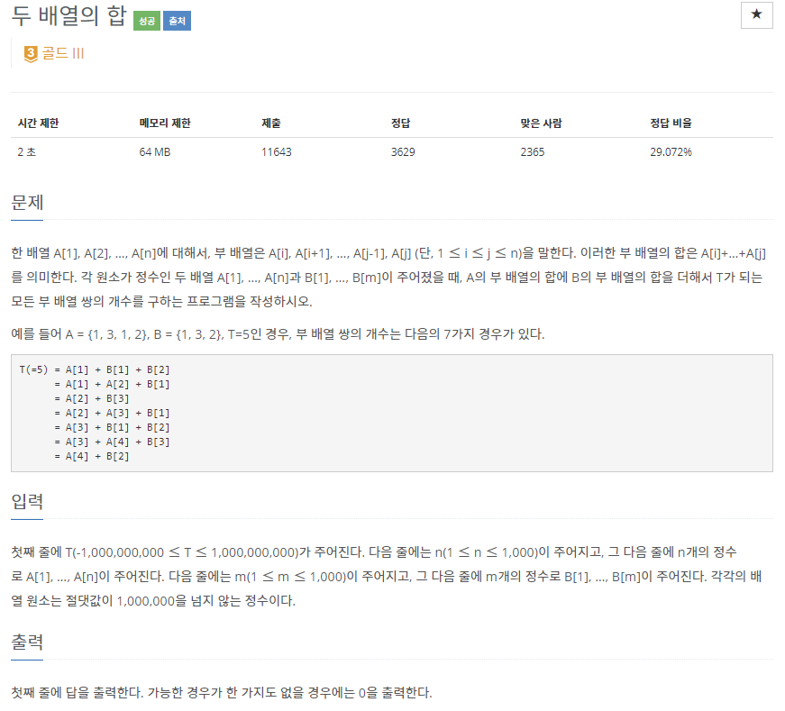
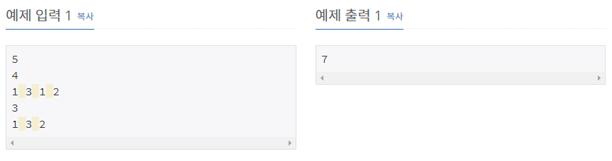

# [[2143] 두 배열의 합](https://www.acmicpc.net/problem/2143)



___
## 🤔접근
1. <b>A의 부분합과 B의 부분합을 더해서 T를 만들 수 있는 경우의 수를 구하자.</b>
	- 각 누적합을 구해 놓고, A의 각 부분합마다 B의 각 부분합을 더해보면서 T를 만들 수 있는 경우의 수를 구해보자.
	- 하지만, 이 방식은 O(N² * M²)으로 TLE이다. O(N² * logM)이하의 방법은 없을까?
2. <B>이번에는 각각 부분합을 모두 구해서 배열에 따로 저장한 뒤, 이를 이용해보자.</B>
	- 각각 부분합을 구하는 시간은 O(N²), O(M²)이다.
	- 목표는 A의 부분합 + B의 부분합 = T의 개수를 구하는 것이다.
		- 즉, B의 부분합 중에서 T + A의 부분합를 만족하는 개수를 구하면 된다.
		- B의 부분합 배열에서 T + A를 만족하는 값을 찾는 것이므로, B의 부분합 배열을 오름차순으로 정렬한 뒤, 이분 탐색으로 개수를 찾으면 된다.
		- 시간 복잡도: O(N² * logM²)
___
## 💡풀이
- <B>이분 탐색(Binary Search) 알고리즘</B>을(를) 사용하였다.
	- 각 배열의 모든 부분합을 저장하는 배열을 만들자.
	- 위에서 만든 한 쪽 배열(prefixSumB)을 오름차순으로 정렬하자.
	- prefixSumB에서 T - prefixSumA의 개수를 upper_bound, under_bound를 이용하여 구하자.
___
## ✍ 피드백
1. <b>모든 부분합을 구하는 연산과, 구한 부분합을 이용하는 연산을 분리하여 사용하자.</b>
	- 두 배열의 모든 부분합을 구하는 연산은 O(N² * M²)으로, 매우 오래걸리는 연산이다.
	- 이를 각각 구하면 O(N²)와 O(M²)으로 구할 수 있으며, 이를 이분탐색과 같은 알고리즘을 이용하면 O(N² * logM²)으로 효율적으로 답을 구할 수 있다.
___
## 💻 핵심 코드
```c++
int main() {
	...

	sort(prefixSumB.begin(), prefixSumB.end()); // for binary-search

	long long ans = 0;
	for (auto a : prefixSumA) 
		ans += (upper_bound(prefixSumB.begin(), prefixSumB.end(), T - a) - lower_bound(prefixSumB.begin(), prefixSumB.end(), T - a));
	

	...
}
```