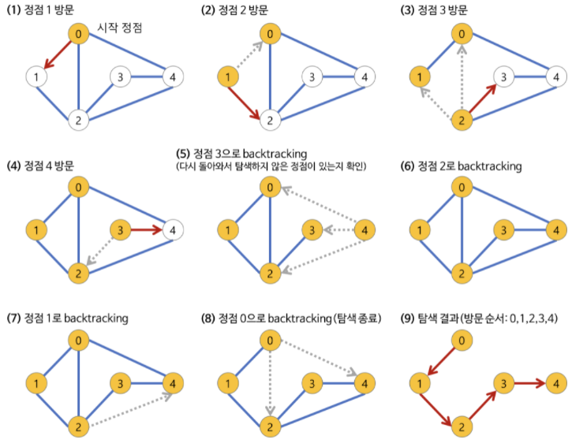

# 깊이 우선 탐색(DFS, Depth-First Search) 알고리즘

## 📖개념
- 한 정점에서 다음 분기(branch)로 넘어가기 전에, 해당 분기를 먼저 완벽하게 탐색하는 방법
	- 넓게(wide) 탐색하기 전에, `깊게(deep)` 탐색하는 방식
	- 더 이상 분기가 없는 경우, 이전으로 돌아간다.
		- 이것을 구현하려면 지금까지 거쳐운 정점들을 모두 저장해둬야 한다.
		- `재귀 호출`을 이용하면 간단하게 구현이 가능!
	- `한 번 방문한 정점은 다시는 방문하지 않아야 한다.`
- <b>시간 복잡도</b>
	- `인접 리스트`로 구현한 그래프: `O(|V| + |E|)`
		- 그래프 내에 간선이 적은 `희소 그래프(Sparse Graph)`의 경우, 인접 리스트로 그래프를 구현하는 것이 효율적이다.
	- `인접 행렬`로 구현한 그래프: `O(|V|²)`
### 깊이 우선 탐색(DFS) 과정

___
## 💻구현
```c++
int N; // 정점 개수
vector<vector<int>> adj; // 그래프의 인접 리스트 표현
vector<bool> visited; // 정점 방문 여부

void DFS(int cur){
	process();
	visited[cur] = true;
	for (int i = 0; i < adj[cur].size(); i++){
		if (!visited[adj[cur][i]])
			DFS(adj[cur][i]);
	}
}

void init(){
	adj.assign(N, vector<int>(N, -1));
	visited.assign(N, false);
	for (int i = 0; i < N; i++) // 모든 정점 순회
		if (!visited[i])
			DFS(i);
}
```