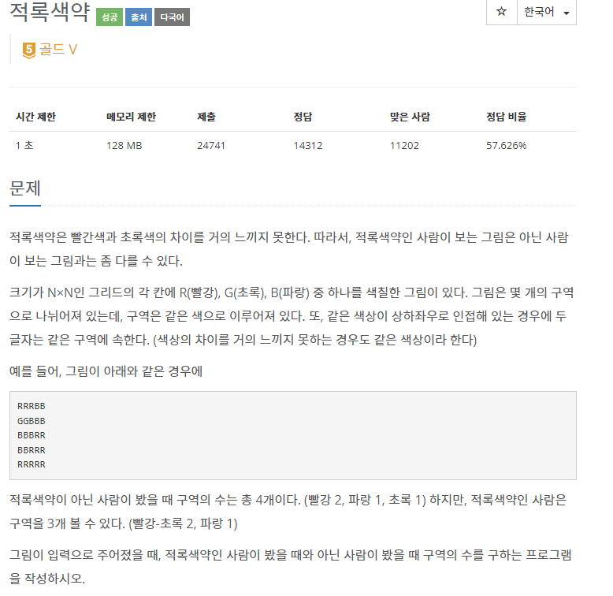

# [[10026] 적록색약](https://www.acmicpc.net/problem/10026)



___
## 🤔접근
___
## 💡풀이
- <b>알고리즘 & 자료구조</b>
	- `DFS`
___
## ✍ 피드백
___
## 💻 핵심 코드
```c++
void DFS(const vector<string>& v, int row, int col, char color) {
	for (int i = 0; i < 4; i++) {
		int nextRow = row + dr[i];
		int nextCol = col + dc[i];

		if (nextRow < 0 || nextCol < 0 || nextRow >= v.size() || nextCol >= v.size())
			continue;
		if (v[nextRow][nextCol] != color)
			continue;
		if (isVisited[nextRow][nextCol])
			continue;

		isVisited[nextRow][nextCol] = true;
		DFS(v, nextRow, nextCol, color);
	}
}
```