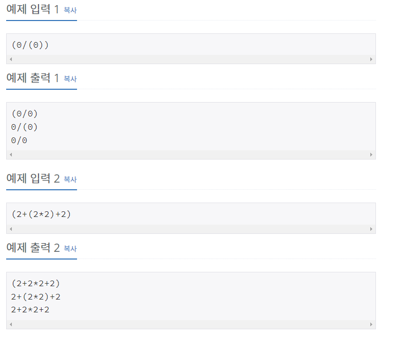

# [[2800] 괄호 제거](https://www.acmicpc.net/problem/2800)



___
## 🤔접근
- 먼저 괄호의 짝을 맞추고, 각 괄호 쌍에 번호를 부여함으로써 각 괄호 쌍을 제거해서 나올 수 있는 모든 경우의 수를 구하자.
___
## 💡풀이
- <b>알고리즘 & 자료구조</b>
	- `DFS`
	- `set`
- <b>구현</b>
	- `bracket_mapper`에 index를 담아 올바른 괄호의 쌍을 찾아주고, 이를 `bit_mapper`에 괄호 쌍에 대한 번호를 부여하는 데 이용하였다.
		> - 예를 들어, 괄호가 `((()))`와 같이 존재한다면, `(`를 만났을 때는 cnt++, `)`를 만났을 때는 cnt--함으로써, 각 괄호의 짝을 올바르게 맺어줄 수 있다. (`stack 원리`)<br>
		> - 만약, `(())()`와 같이 존재한다면, 첫 번째 괄호 쌍과 세 번째 괄호 쌍의 cnt 값이 같아져서 문제가 되지 않을까? 라는 생각이 들 수도 있다.
		> 	- 잘 생각해보면, 첫 번째 괄호 내부를 이미 처리한 이후 새로운 괄호를 처리하는 셈이므로, 아무런 문제가 없다.
	- `bit_mapper`에 모든 괄호 쌍에 괄호 번호를 입력해준 다음, DFS를 이용하여 괄호 쌍을 제거해서 나올 수 있는 모든 경우의 수를 탐색하였다.
		- 이를 자료구조 `set`에 결과를 저장하였으므로, 사전 순으로 정렬되어있다.
___
## ✍ 피드백
___
## 💻 핵심 코드
```c++
void DFS(int idx, int bitmask) {
	if (idx == total) {
		string answer = "";
		for (int i = 0; i < math_expression.size(); i++) {
			if (math_expression[i] == '(' || math_expression[i] == ')') {
				if ((1 << bit_mapper[i]) & bitmask)
					continue;
			}
			answer += math_expression[i];
		}
		ans.insert(answer);
		return;
	}

	for (int i = idx + 1; i <= total; i++) {
		DFS(i, bitmask | (1 << i));
		DFS(i, bitmask);
	}
}

int main() {
	...

	int idx = 0, cnt = 0;
	cin >> math_expression;
	for (auto cur : math_expression) {
		if (cur == '(') {
			bracket_mapper[++cnt] = idx;
			bit_mapper[idx] = ++total;
		}
		else if (cur == ')') {
			int index = bracket_mapper[cnt--];
			bit_mapper[idx] = bit_mapper[index];
		}
		idx++;
	}

	...
} 
```