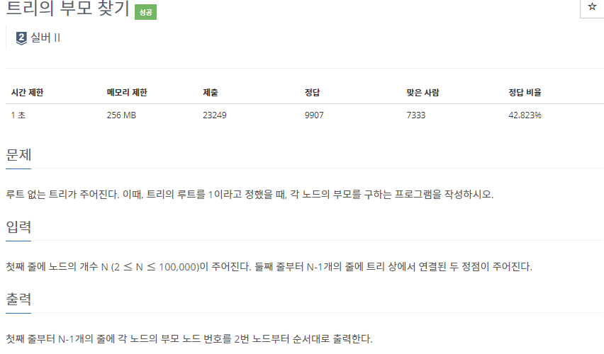
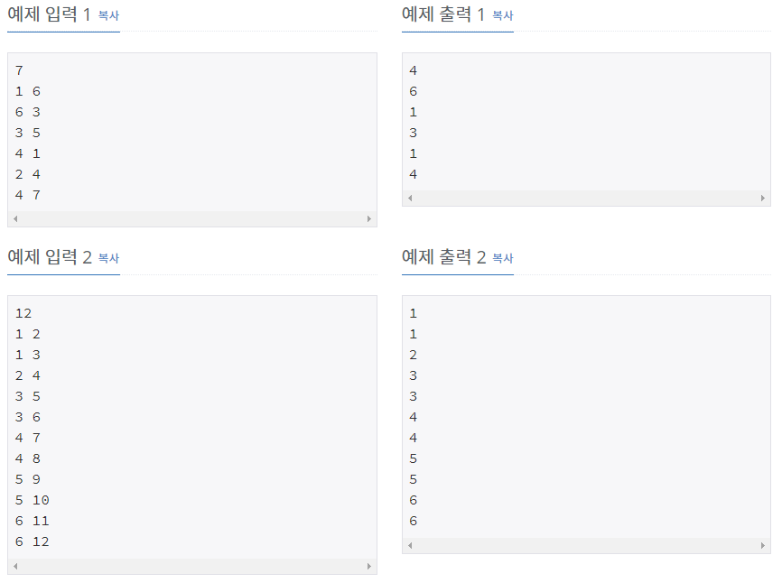

# [[11725] 트리의 부모 찾기](https://www.acmicpc.net/problem/11725)



___
## 🤔접근

___
## 💡풀이
- <b>DFS 알고리즘</b>을(를) 이용하였다.
	- 입력으로 주어진 두 노드를 연결시킨 후, 1번 노드부터 탐색한다.
	- 이 때, 탐색하는 노드와 연결된 노드들 중에 방문하지 않은 노드의 경우, 부모 노드를 설정하고, DFS으로 해당 노드를 탐색한다.
___
## ✍ 피드백
___
## 💻 핵심 코드
```c++
void DFS(int par) {
	visited[par] = true;

	for (int v : edges[par]) {
		if (visited[v] == false) {
			parent[v] = par;
			DFS(v);
		}
	}
}
```