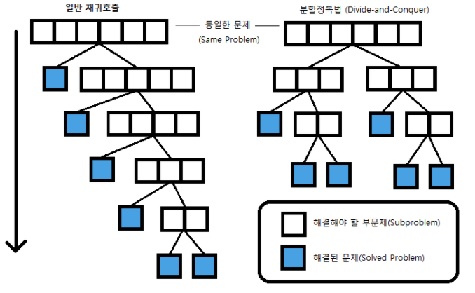

# 분할 정복(Divide & Conquer) 알고리즘

## 📖개념
- <b>일반적인 재귀 호출</b>
    - 문제를 한 조각과 나머지 전체로 나누어 해결
- <b>분할 정복</b>
    - 문제를 `거의 같은 크기`의 부분 문제로 나누어 해결
    

___
## 📐알고리즘 설계
1. 문제를 더 작은 문제로 분할하는 과정(`divide`)
2. 각 문제에 대해 구한 답을 원래 문제에 대한 답으로 병합하는 과정(`merge`)
3. 더 이상 답을 분할하지 않고, 곧장 풀 수 있는 매우 작은 문제(`base case`)
___
## 💡응용
### 1. 수열의 빠른 합
- 1부터 n까지의 합을 n개의 조각으로 나눈 뒤, 이들을 반으로 잘라 각 n/2개 조각들로 만들어진 부분 문제 두 개로 나눔.
    - <b>(1 ~ n/2), (n/2 + 1 ~ n)</b>
- `fastSum(n/2) = (1 + ... + n/2)`라 할 때, 첫 번째 부분 문제는 fastSum(n/2)으로 나타낼 수 있다.
- 두 번째 부분 문제는 다음과 같이 나타낼 수 있다.
    > (n/2 + 1 + ... + n)
    > - (n/2 + 1) + (n/2 + 2) + ... + (n/2 + n/2)
    > - n/2 * n/2 + (1 + 2 + ... + n/2)
    > - n/2 * n/2 + fastSum(n/2) 
- 즉, `fastSum(n) = 2 * fastSum(n/2) + n²/4 (n이 짝수일 때)`으로 나타낼 수 있다.
    - n이 홀수일 때는 짝수인 n-1까지의 합을 재귀호출로 계산하고, n을 더해 답을 구해야 한다.
- 💻 <b>1부터 n까지의 합을 구하는 분할 정복 알고리즘</b>
    ```c++
    // 필수 조건: n은 자연수
    // 1 + 2 + ... + n을 반환한다.

    int fastSum(int n){
        if (n == 1) // base condition
            return 1;
        if (n % 2 == 1)
            return fastSum(n - 1) + n;
        return 2 * fastSum(n / 2) + (n / 2) * (n / 2);
    }
    ```
- 시간 복잡도: `O(log₂N)`
### 2. 행렬의 거듭제곱
- N x N 크기의 행렬 A가 주어질 때, A의 거듭 제곱(power) Aⁿ은 A를 연속해서 n번 곱한 것
- 분할 정복을 적용하면, Aⁿ = √Aⁿ * √Aⁿ
    - n이 홀수일 때는 A를 한 번 곱해주고, 1을 빼서 짝수로 만들어 분할정복한다.
- 💻 <b>행렬의 거듭제곱을 구하는 분할 정복 알고리즘</b>
    ```c++
    // 정방행렬을 표현하는 Matrix 클래스
    class Matrix;
    // N x N 크기의 항등 행렬(identity matrix)을 반환하는 함수
    Matrix identity(int N);
    // Aⁿ을 반환한다.
    Matrix pow(const Matrix& A, int n){
        if (n == 0) // base condition
            return identity(A.size());
        if (n % 2 > 0)
            return pow(A, n - 1) * A;
        Matrix half = pow(A, n / 2);
        return half * half;
    }
    ```
    - 시간 복잡도: `O(log₂N)`
- <b>큰 피보나치 수</b>
    ```c++
    typedef vector<vector<long long>> matrix;
    matrix operator* (const matrix& A, const matrix& B) {
    	int n = A.size();
    	matrix res(n, vector<long long>(n));

    	for (int i = 0; i < n; i++)
    		for (int j = 0; j < n; j++)
    			for (int k = 0; k < n; k++)
    				res[i][j] = (res[i][j] + A[i][k] * B[k][j]) % MOD;

    	return res;
    }

    long long getFibonacci(long long n) {
    	matrix res = {{1, 0}, {0, 1}};
    	matrix c = {{1, 1}, {1, 0}};

    	while (n) {
    		if (n % 2)
    			res = res * c;
    		c = c * c;
    		n /= 2;
    	}

    	return res[0][1];
    }
    ```
    - 시간 복잡도: `O(M³log₂N)`
### 3. 병합 정렬(Merge Sort)
- <b>정렬 과정</b>
    1. 주어진 수열을 가운데에서 `쪼개 비슷한 크기의 수열 두 개`로 만든 뒤, 이들을 재귀 호출을 이용하여 각각 정렬한다.
    2. 이후 정렬된 배열을 `하나로 합침`으로써 정렬된 전체 수열을 얻는다.
- 시간 복잡도: `O(N * log₂N)`
### 4. 퀵 정렬(Quick Sort)
- `파티션(partition)`이라고 부르는 단계를 도입한다.
    - 배열에 있는 수 중 임의의 `기준 수(pivot)`를 지정한 후, 기준보다 작거나 같은 숫자를 왼쪽, 더 큰 숫자를 오른쪽으로 보내는 과정이다.
- 시간 복잡도
    - Worst case: `O(N²)`
    - Best/Average case: `O(log₂N)`