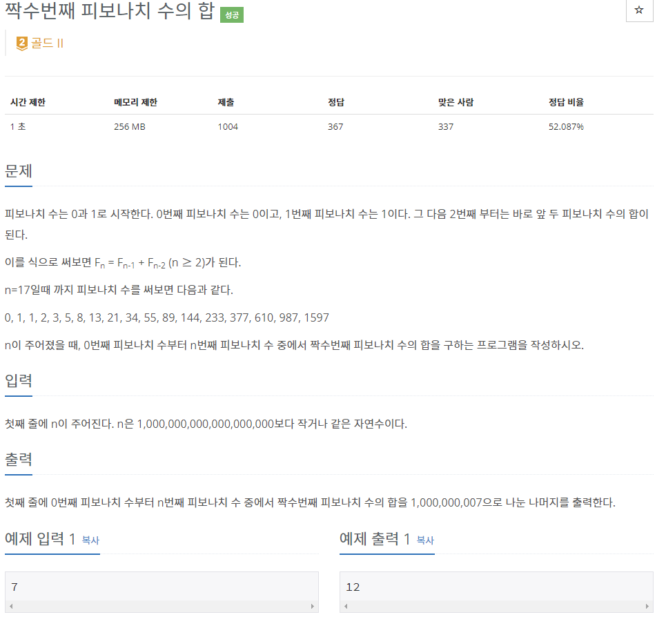

# [[11443] 짝수번째 피보나치 수의 합](https://www.acmicpc.net/problem/11443)


___
## 🤔접근
- 짝수번째 피보나치 수의 합은 점화식을 통해 다음 공식을 도출해낼 수 있다.
	- 예를 들어 6번째까지의 짝수번째 피보나치 수의 합은 아래와 같이 구할 수 있다.
		- F(6) = F(5) + F(4)
		- F(6) = 2 * F(4) + F(3)
		- F(6) = 2 * F(4) + F(2) + F(1)
		- 따라서 F(6) + F(6) - F(4) - F(1)으로 구할 수 있다.
___
## 💡풀이
- <b>알고리즘 & 자료구조</b>
	- `분할 정복을 이용한 행렬 거듭 제곱`
- <b>구현</b>
	- 홀수인 경우 1을 뺴주어 공식 적용
	- `2 * F(a) - F(a - 2) - F(1)`
___
## ✍ 피드백
___
## 💻 핵심 코드
```c++
typedef vector<vector<long long>> matrix;

matrix operator* (const matrix& A, const matrix& B) {
	int n = A.size();
	matrix res(n, vector<long long>(n));

	for (int i = 0; i < n; i++)
		for (int j = 0; j < n; j++)
			for (int k = 0; k < n; k++)
				res[i][j] = (res[i][j] + A[i][k] * B[k][j]) % MOD;

	return res;
}

long long getFibonacci(long long n) {
	matrix res = {{1, 0}, {0, 1}};
	matrix c = {{1, 1}, {1, 0}};

	while (n) {
		if (n % 2)
			res = res * c;
		c = c * c;
		n /= 2;
	}

	return res[0][1];
}

int main() {
	...

	if (a == 1) {
		cout << 0;
		return 0;
	}

	if (a % 2)
		a--;

	cout << (2 * getFibonacci(a) - getFibonacci(a - 2) - 1 + MOD) % MOD;

	...
}
```