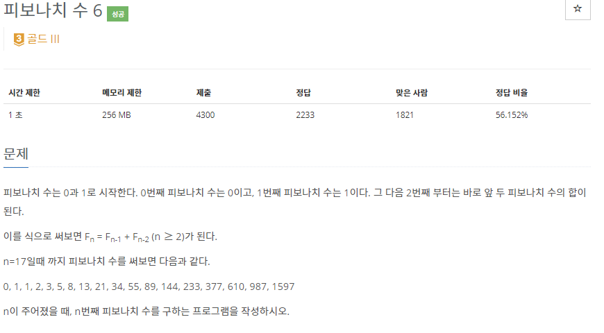
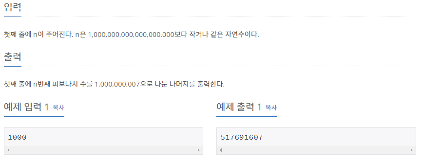
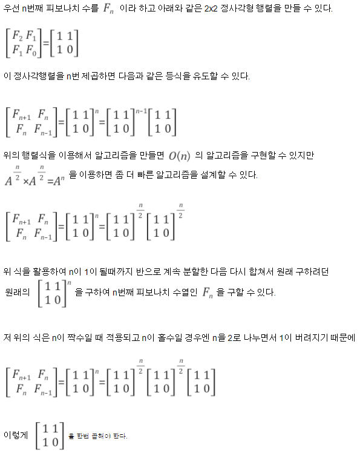

# [[11444] 피보나치 수 6](https://www.acmicpc.net/problem/11444)



___
## 🤔접근
1. <b>n이 최대 1,000,000,000,000,000,000이다.</b>
	- 동적계획법을 이용해도 시간복잡도가 `O(N)`이므로, 다른 방법이 필요하다.
	- 피보나치 수열을 행렬로 나타내어 거듭제곱 형태로 분할정복하는 방식을 이용하자.
___
## 💡풀이
- <b>분할 정복 알고리즘</b>을(를) 이용하였다.
	- 
- 시간 복잡도: `O(log₂N)`
___
## ✍ 피드백
1. DP로 피보나치 수열을 구하면 `O(N)`임에 주의하자.
___
## 💻 핵심 코드
```c++
typedef vector<vector<long long>> matrix;
matrix operator* (const matrix& a, const matrix& b);

matrix ans = {{1, 0}, {0, 1}}; // 단위 행렬
matrix a = {{1, 1}, {1, 0}}; // base condition: f(2), f(1), f(1), f(0)

while (n > 0) {
	if (n % 2 == 1) {
		ans = ans * a;
	}
	a = a * a;
	n /= 2;
}

cout << ans[0][1];
```