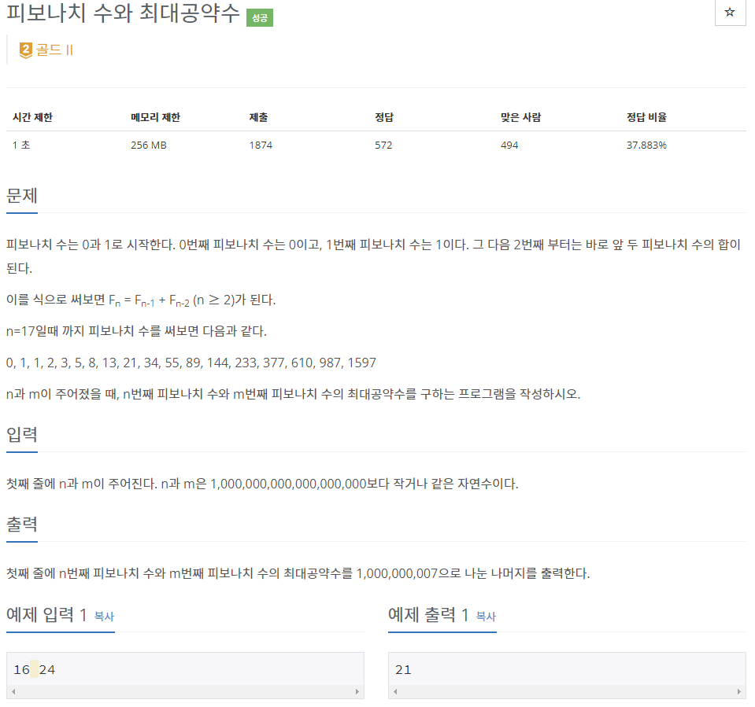

# [[11778] 피보나치 수와 최대공약수](https://www.acmicpc.net/problem/11778)


___
## 🤔접근
- `gcd(a, b) = g`일 때, `gcd(F(a), F(b)) = F(g)`임을 이용하자.
___
## 💡풀이
- <b>알고리즘 & 자료구조</b>
	- `분할 정복을 이용한 행렬 거듭 제곱`
	- `유클리드 호제법`
- <b>구현</b>
___
## ✍ 피드백
___
## 💻 핵심 코드
```c++
typedef vector<vector<long long>> matrix;

matrix operator* (const matrix& A, const matrix& B) {
	int n = A.size();
	matrix res(n, vector<long long>(n));

	for (int i = 0; i < n; i++)
		for (int j = 0; j < n; j++)
			for (int k = 0; k < n; k++)
				res[i][j] = (res[i][j] + A[i][k] * B[k][j]) % MOD;

	return res;
}

long long getFibonacci(long long n) {
	matrix res = {{1, 0}, {0, 1}};
	matrix c = {{1, 1}, {1, 0}};

	while (n) {
		if (n % 2)
			res = res * c;
		c = c * c;
		n /= 2;
	}

	return res[0][1];
}

long long getGcd(long long a, long long b) {
	if (b == 0)
		return a;

	return getGcd(b, a % b);
}

int main() {
	...

	cout << getFibonacci(getGcd(a, b));

	...
}
```