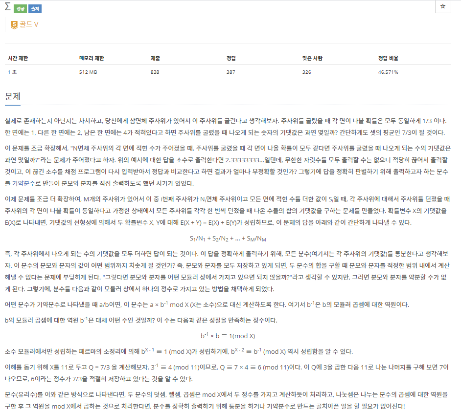
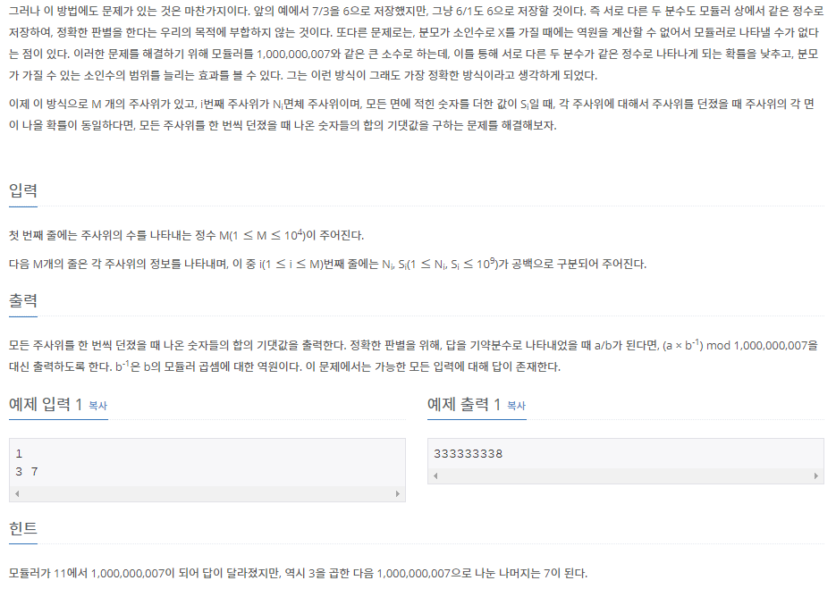

# [[13172] ∑](https://www.acmicpc.net/problem/13172)



___
## 🤔접근
1. <b>기댓값: `∑(S * N¯¹ % n)`</b>
	- `Nⁿ¯² ≡ N¯¹ (mod n)`임이 주어졌으므로, 분할정복을 통해 빠르게 Nⁿ¯²을 구하자.
___
## 💡풀이
- <b>분할정복(Divide and Conquer) 알고리즘</b>을(를) 사용하였다.
	- n은 10⁹+7으로 매우 크므로, `long long` 자료형을 사용하자.
		> int형을 사용하면, 연산 중에 overflow가 발생할 수 있다.
	- 연산마다 모듈러 연산을 추가로 수행해 주어야 한다.
___
## ✍ 피드백
___
## 💻 핵심 코드
```c++
int main(){
	...
	long long ans = 0;
	for (int i = 0; i < M; i++) {
		int N, S;
		cin >> N >> S;
		
		// convert to reduced fraction(생략해도 상관 없음)
		int g = gcd(N, S);
		N /= g;
		S /= g;

		// (S * Nⁿ¯²) % MOD
		ans += (S * divideAndConquer(N, MOD - 2)) % MOD;
		ans %= MOD;
	}
	
	cout << ans;
}

long long divideAndConquer(long long val, int pow) {
	long long res = 1;

	while (pow) {
		if (pow & 1) // if pow is odd, multiply one more time
			res = (res * val) % MOD;
		val = (val * val) % MOD;
		pow >>= 1;
	}
	
	return res;
}
```