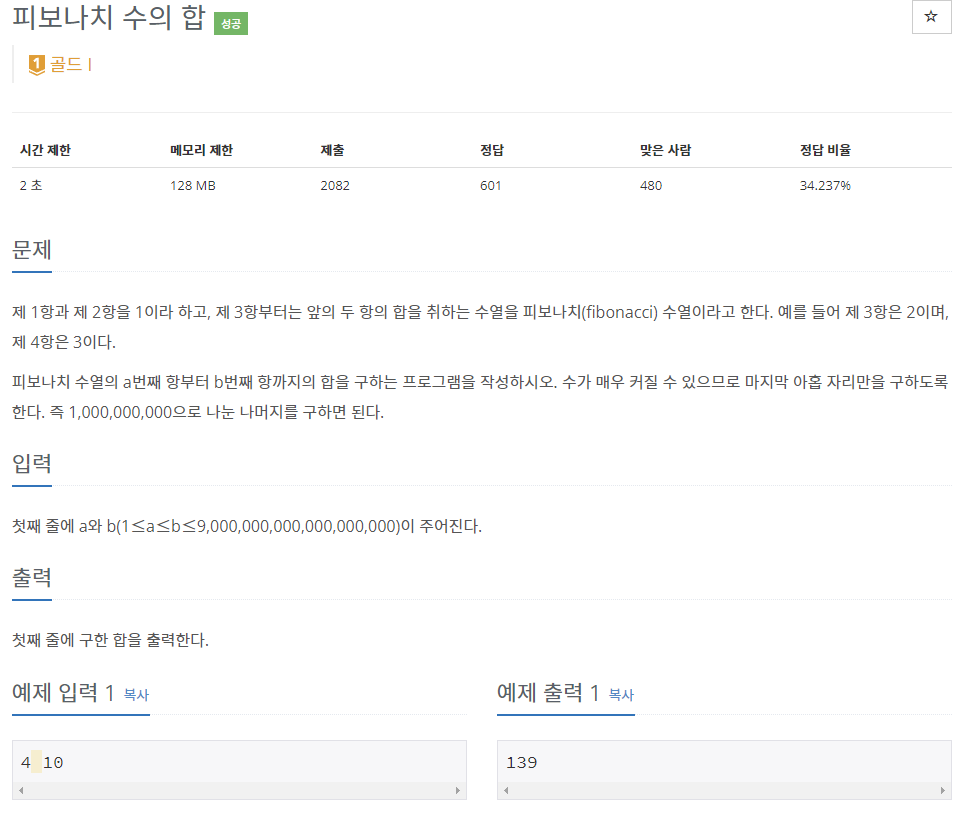

# [[2086] 피보나치 수의 합](https://www.acmicpc.net/problem/2086)


___
## 🤔접근
- 피보나치 점화식을 이용하여 F(i) + F(i + 1) + ... + F(i + m)을 구하는 공식을 얻어낼 수 있다.
	- 예를 들어, F(6)을 작은 문제로 나누어 보자.
		- F(6) = F(5) + F(4) = F(4) + 2 * F(3) + F(2)
		- 여기에 F(3)을 뺴주면 F(2)부터 F(4)까지의 합을 구할 수 있게 된다.
		- 즉, a = 2, b = 4일 때 피보나치 합을 구하는 공식은 F(4 + 2) - F(2 + 1)
___
## 💡풀이
- <b>알고리즘 & 자료구조</b>
	- `분할 정복을 이용한 행렬 거듭 제곱`
- <b>구현</b>
	- [a, b] 피보나치 합 공식: `F(b + 2) - F(a + 1)`
___
## ✍ 피드백
___
## 💻 핵심 코드
```c++
typedef vector<vector<long long>> matrix;

matrix operator* (const matrix& A, const matrix& B) {
	int n = A.size();
	matrix res(n, vector<long long>(n));

	for (int i = 0; i < n; i++)
		for (int j = 0; j < n; j++)
			for (int k = 0; k < n; k++)
				res[i][j] = (res[i][j] + A[i][k] * B[k][j]) % MOD;

	return res;
}

long long getFibonacci(long long n) {
	matrix res = {{1, 0}, {0, 1}};
	matrix c = {{1, 1}, {1, 0}};

	while (n) {
		if (n % 2)
			res = res * c;
		c = c * c;
		n /= 2;
	}

	return res[0][1];
}

int main() {
	...

	cout << (getFibonacci(b + 2) - getFibonacci(a + 1) + MOD) % MOD;

	...
}
```