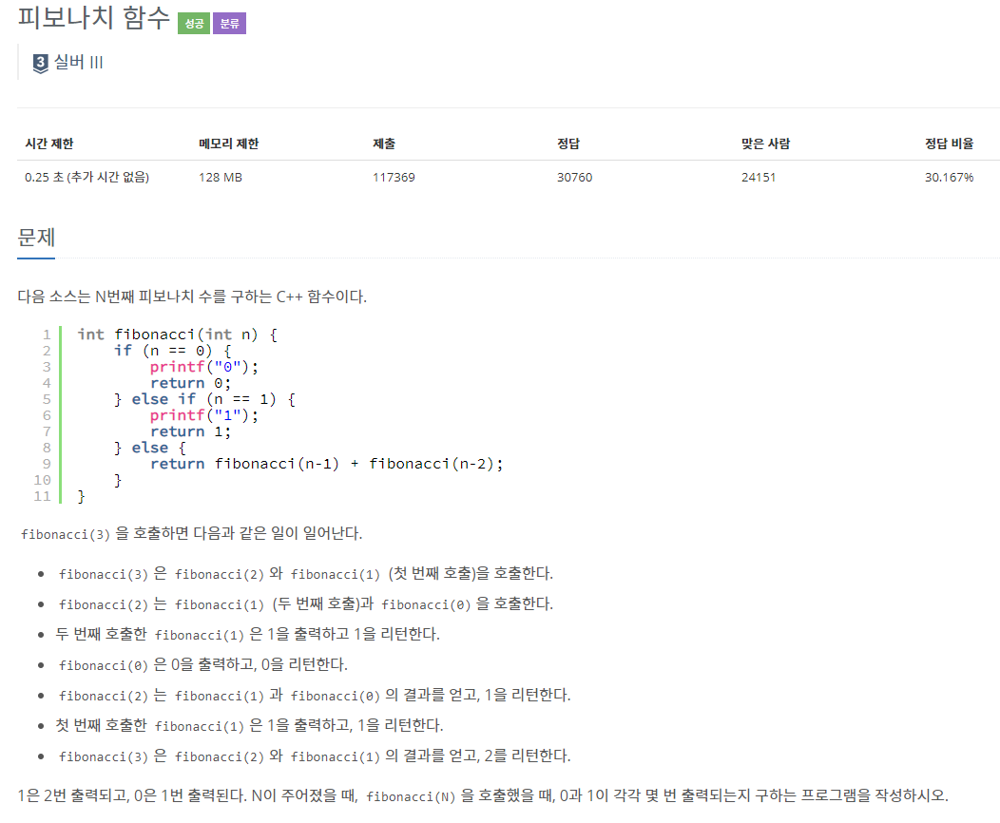
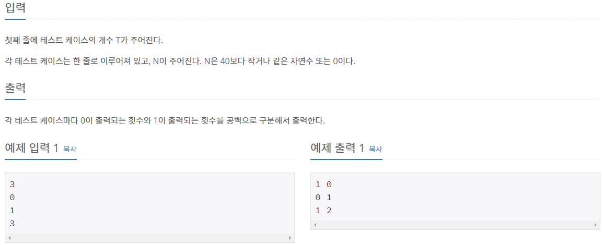

## [[1003] 피보나치 함수](https://www.acmicpc.net/problem/1003)



___
## 💡풀이
- 동적계획법을 이용하였다.
- bottom-up 방식으로 구현하였으며, 다음과 같이 메모이제이션을 사용하였다.
	- 각 인덱스의 캐시마다 0과 1이 사용된 개수를 저장하였다.
	- 점화식 : dp[i] = dp[i - 1] + dp[i - 2]
```c++
pair<int, int> fibonacci(int n) {
    if (n == 0)
        return make_pair(1, 0);
    else if (n == 1)
        return make_pair(0, 1);

    pair<int, int> dp[41];
    fill(dp, dp + 41, make_pair(0, 0));

    dp[0] = make_pair(1, 0);
    dp[1] = make_pair(0, 1);

    for (int i = 2; i <= n; i++) {
        dp[i] = dp[i - 1] + dp[i - 2];
    }

    return dp[n];
}
```