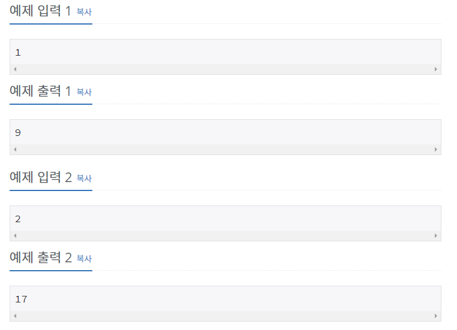

## [[10844] 쉬운 계단 수](https://www.acmicpc.net/problem/10844)



___
## 💡풀이
- 동적계획법을 이용하였다.
- Bottom-up 방식으로 구현하였다.
	- N이 i일 때, i-1에서의 끝 자리 수에 따라 i에서의 경우의 수를 따져야 한다.
		> ex) N이 1인 경우(9) : 1 / 2 / 3 / 4 / 5 / 6 / 7 / 8 / 9<br>
		> ex) N이 2인 경우(17) : 10 / 21 / 12, 32 / 23, 43 / 34, 54 / 45, 65 / 56, 76 / 67, 87 / 78, 98 / 89
		- 예를들어, N이 2일 때 2로 끝나는 수는 2±1인 1, 3과 조합하여 12, 32로 나타낼 수 있으며, 이는 N이 1일때 1, 3으로 끝나는 수와 조합할 수 있는 경우의 수로 나타낼 수 있다.
		- 즉, N에 대해 n으로 끝나는 수의 개수는 N-1에 대해 n±1로 끝나는 수들을 조합한 경우의 수이다.
			```c++
			// N == i, n == j 으로 매핑하여 이해하자.
			for (int j = 1; j < 9; j++) 
            	dp[i][j] = dp[i - 1][j - 1] + dp[i - 1][j + 1];
		    ```
		- 추가로, 0과 9로 끝나는 수의 개수에 대해서는 N-1에 대해 각각 n+1, n-1로 끝나는 수들을 조합한 경우의 수만 적용한다.
			```c++
			dp[i][0] = dp[i - 1][1]; // 0-1 : -1(불가)
        	dp[i][9] = dp[i - 1][8]; // 9+1 : 10(불가)
	    	```
		- 정리
			- `dp[단계][끝자리 숫자]` : 해당 `단계`에서 `끝자리 숫자`로 끝나는 모든 숫자들의 개수를 저장
```c++
// Base condition
for (int i = 1; i < 10; i++) 
    dp[1][i] = 1;
    
// Bottom-up
for (int i = 2; i <= N; i++) {
    dp[i][0] = dp[i - 1][1];
    dp[i][9] = dp[i - 1][8];
    for (int j = 1; j < 9; j++) 
        dp[i][j] = (dp[i - 1][j - 1] + dp[i - 1][j + 1]) % 1000000000;     
}

int answer = 0;
for (int i = 0; i < 10; i++) 
    answer = (answer + dp[N][i]) % 1000000000;

cout << answer;
```