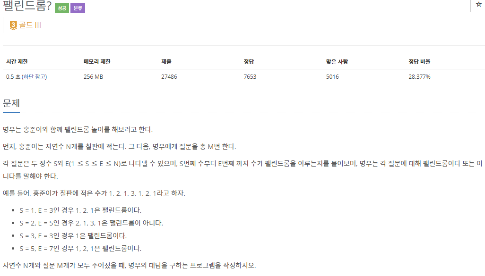
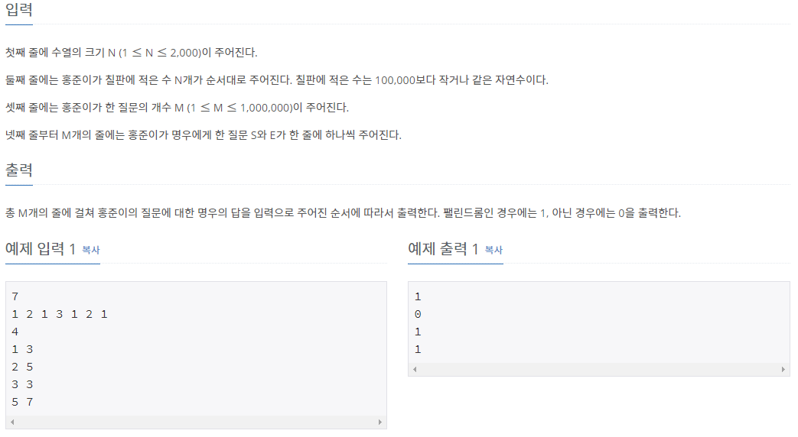

## [[10942] 펠린드롬?](https://www.acmicpc.net/problem/10942)



___
## 💡풀이
- <b>동적계획법을 이용하였다.</b>
	- 숫자를 1개부터 N개까지 하나씩 증가시키면서 해당 개수의 숫자들이 펠린드롬을 이루는지 확인하는 문제이다.
	- 만약, 주어진 S, E 사이의 숫자들이 펠린드롬인지 판별하기 위해 일일이 하나하나씩 확인한다면, 최악의 경우 연산 횟수가 무려 50,000 * 1,000,000번이다.
	- 물론 중복되는 연산을 줄이는 방법이 존재한다. 다음의 규칙성을 확인해보자.
		- (S+1) ~ (E-1) 사이의 숫자들이 펠린드롬을 이루고, S와 E의 숫자가 같다면, S ~ E 사이의 숫자들도 펠린드롬을 이룬다.
			```c++
			if (seq[start] == seq[end] && dp[start + 1][end - 1] == true) 
				dp[start][end] = true;
			```
___
## ✍ 피드백
___
## 💻 핵심 코드
```c++
vector<vector<bool>> dp(N + 1, vector<bool>(N + 1));
// base condition
for (int i = 1; i <= N; i++) 
	dp[i][i] = true;
for (int i = 1; i < N; i++) 
	if (seq[i] == seq[i + 1])
		dp[i][i + 1] = true;

// bottom-up
for (int range = 3; range <= N; range++) {
	for (int start = 1; start + range - 1 <= N; start++) {
		int end = start + range - 1;

		if (seq[start] == seq[end] && dp[start + 1][end - 1] == true) 
			dp[start][end] = true;
	}
}
```