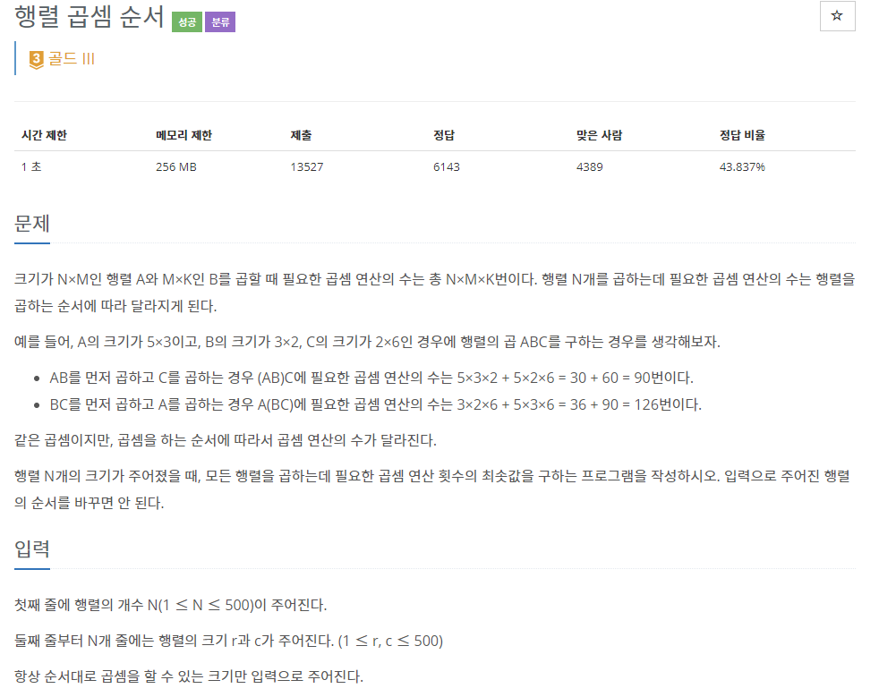
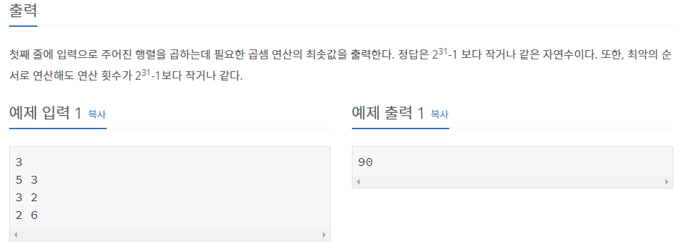

## [[11049] 행렬 곱셈 순서](https://www.acmicpc.net/problem/11049)



___
## 💡풀이
- <b>동적계획법을 이용하였다.</b>
	- 두 행렬 곱셈은 항상 아래의 조건을 만족해야 한다.
		- M₁ x M₂ (M₁의 column수 = M₂의 row수)
		- 곱셈 결과 : M₃(row = `M₁의 row`, column = `M₂의 column`)
	- 그러므로 주어진 행렬은 반드시 연속으로 곱해야하며, 문제의 다음 문장에도 주목하자.
		- 행렬 N개의 크기가 주어졌을 때, 모든 행렬을 곱하는데 필요한 곱셈 연산 횟수의 최솟값을 구하는 프로그램을 작성하시오. `입력으로 주어진 행렬의 순서를 바꾸면 안 된다.`
	- 각 행렬들을 두 개씩 연속적으로 곱하여 최종적으로 하나의 행렬을 만들어야 하므로, `각각의 부분 문제(행렬)들을 하나의 큰 문제(행렬)로 합치는 방식`, 즉 동적계획법으로 해결할 수 있다.
	- <b>Bottom-up 점화식</b>
		- `dp[first][last] = min(dp[first][last], dp[first][mid] + dp[mid + 1][last] + matrix[first].first * matrix[mid].second * matrix[last].second);`
	- <b>분석</b>
		- `dp[first][last]`
			- first matrix부터 last matrix까지 행렬 곱셈을 했을 때의 최소 곱셈 연산 수
		- `dp[first][mid] + dp[mid + 1][last]`
			- 각각 <b>(first matrix부터 mid matrix까지 곱한 결과의 행렬)</b>과 <b>(mid + 1 matrix부터 last matrix까지 곱한 결과의 행렬)</b>이 만들어지기까지의 최소 곱셈 연산 횟수의 합
		- `matrix[first].first * matrix[mid].second * matrix[last].second`
			- <b>(first matrix부터 mid matrix까지 곱한 결과의 행렬)</b>과 <b>(mid + 1 matrix부터 last matrix까지 곱한 결과의 행렬)</b>의 두 행렬을 곱했을 때의 곱셈 연산 횟수
	- <b>구현 방법</b>
		- 생각해보면 결국, 첫 번째 행렬부터 중간의 어느지점까지 곱한 결과의 행렬과, 그 지점 다음 행렬부터 마지막 행렬까지 곱한 결과의 행렬을 구하여 두 행렬을 곱했을 때, 최소의 곱셈 연산이 되는 중간의 어느 지점을 찾는 문제이다.<br><br>
		- 중간의 어느 지점을 찾으려면, 위의 두 행렬이 만들어지기까지 곱셈 연산이 최소가 되는 곱셈 순서를 먼저 찾아야 하므로, 각 행렬이 만들어지기 전 곱셈을 할 때의 각 중간 지점을 다시 찾고.. 이 과정이 재귀호출되면서 결국 두 origin 행렬의 곱셈을 하는 부분을 찾게 된다.<br><br>
		- 이를 반대 과정으로 구현하면 Bottom-up 방식이며, range를 1부터 시작해서 N-1까지 1씩 증가시키면서, 행렬을 곱하는 총 개수를 늘려나간다. (피라미드 형태)
			- 첫 번째 행렬부터 range만큼 행렬을 곱하고, 그 다음 행렬에서도 range만큼 행렬을 곱하는 식으로 반복한다.
				- 이 과정에서 first ~ first + range 사이의 중간지점(mid)를 1씩 증가시키면서 최소의 곱셈 연산을 찾는 식으로 구현하였다.
		- 시간 복잡도 : `O(N³)`
___
## ✍ 피드백
___
## 💻 핵심 코드
```c++
vector<vector<int>> dp(N + 1, vector<int>(N + 1, 0));
for (int range = 1; range < N; range++) {
	for (int first = 1; first + range <= N; first++) {
		int last = first + range;
		dp[first][last] = INT_MAX;

		for (int mid = first; mid < last; mid++) {
			dp[first][last] = min(dp[first][last],
				dp[first][mid] + dp[mid + 1][last] + matrix[first].first * matrix[mid].second * matrix[last].second);
		}
	}
}
cout << dp[1][N];
```