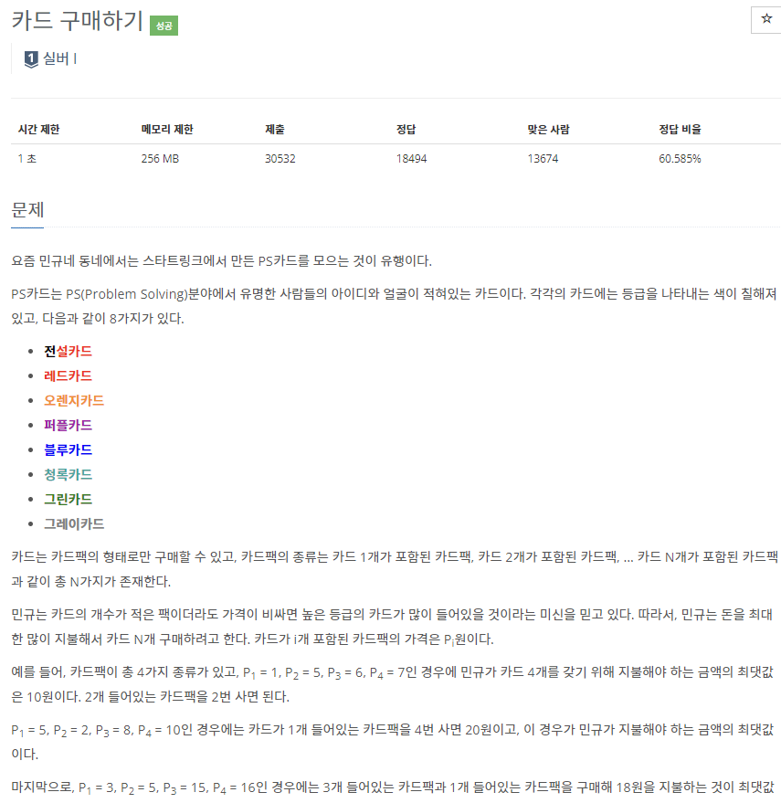
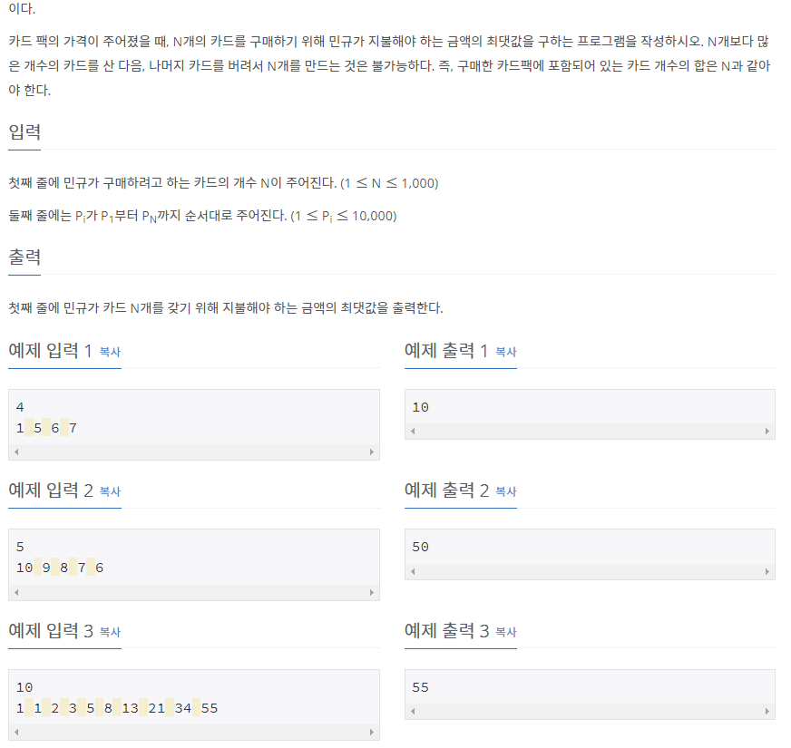

# [[11052] 카드 구매하기](https://www.acmicpc.net/problem/11052)



___
## 🤔접근
1. <B>구매한 카드 개수를 기준으로 최댓값을 갱신하자.</B>
	- 카드팩을 오름차순으로 탐색해보자. 이 때, 탐색하는 카드팩을 i번째라고 해보자.
	- 각 i번째 카드팩에는 i개의 카드가 들어있으므로, i개를 만들 수 있는 1~i번째 카드들을 조합했을 때의 값과 비교하여 최댓값을 구해야 한다.
	- 1~i번째 카드를 탐색하는 카드팩을 j번쨰라고 해보자.
	- 각 j번째 카드팩에는 j개의 카드가 들어있으므로, i-j개의 카드를 구매했을 때의 최댓값에 j번째 카드팩을 구매한 가격이 최댓값인지 비교하는 방식으로 구현해보자.
___
## 💡풀이
- <B>알고리즘 & 자료구조</B>
	- `DP`
- <b>구현</b>
	- Bottom-up 방식 구현
	- 점화식
		```c++
		for (int i = 1; i <= N; i++)
			for (int j = 1; j <= i; j++)
				dp[i] = max(dp[i], dp[i - j] + card[j]);
		```
		- 기저 조건: `dp[0] = 0`
	- 시간 복잡도: `O(N²)`
___
## ✍ 피드백

1. <b>완전탐색(276ms)</b>
```c++
void DFS(int n, int pri) {
	if (n == N)
		return;

	for (int i = 1; n + i <= N; i++) {
		if (dp[n + i] < dp[n] + card[i]) {
			dp[n + i] = dp[n] + card[i];
			DFS(n + i, dp[n + i]);
		}
	}
}
```
___
## 💻 핵심 코드
```c++
int main(){
	...

// bottom-up
	for (int i = 1; i <= N; i++)
		for (int j = 1; j <= i; j++)
			dp[i] = max(dp[i], dp[i - j] + card[j]);

	...
}
```