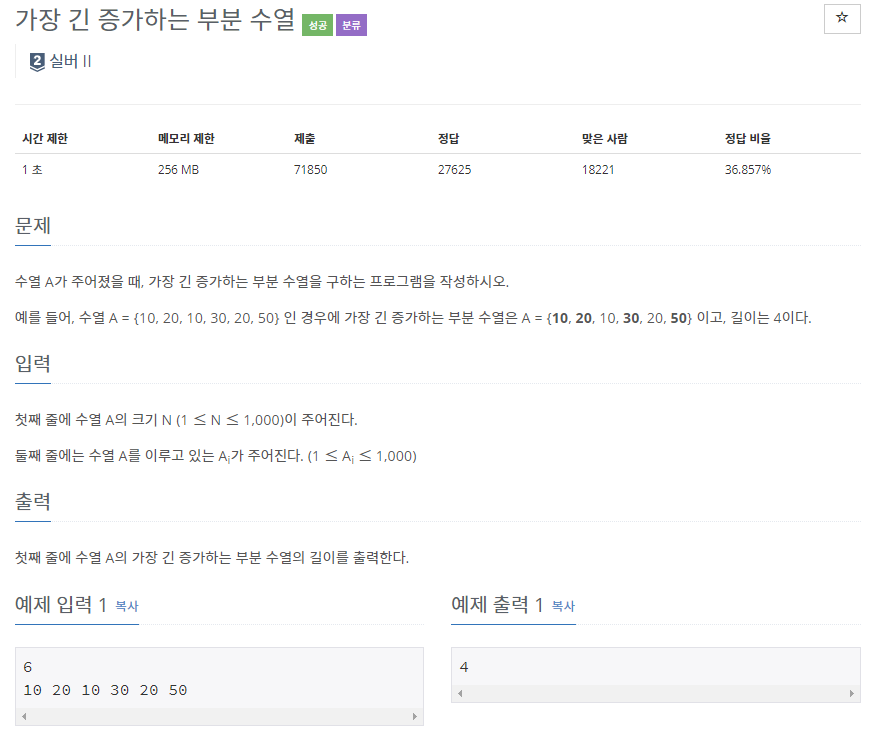

## [[11053] 가장 긴 증가하는 부분 수열](https://www.acmicpc.net/problem/11053)


___
## 💡풀이
- 동적계획법을 이용하였다.
- Bottom-up 방식으로 구현하였다.
	- 첫 번째 원소부터 마지막 원소까지 돌면서, 현재 원소까지의 부분 수열에 대하여 가장 긴 증가하는 부분 수열의 길이를 dp배열에 저장한다.
	- 탐색하는 부분 수열의 원소(j)가 현재 원소(i)보다 작고, 현재 원소에 대한 dp값 보다 1을 더했을 때 큰 경우, 현재 원소의 dp값을 갱신한다.
	> ex)<br>
	> seq : 10 | 20 | 10 | 30 | 20 | 50<br>
	> dp  : 1  | 2  | 1  | 3  | 2  | 4
```c++
   // Base condition
   fill(dp, dp + 1000, 1);

   // Bottom-up
   for (int i = 0; i < N; i++) {
       for (int j = 0; j < i; j++) {
           if (seq[j] < seq[i] && dp[i] < dp[j] + 1) {
               dp[i] = dp[j] + 1;
               if (dp[i] > longest)
                   longest = dp[i];
           }
       }
   }
   cout << longest;
```