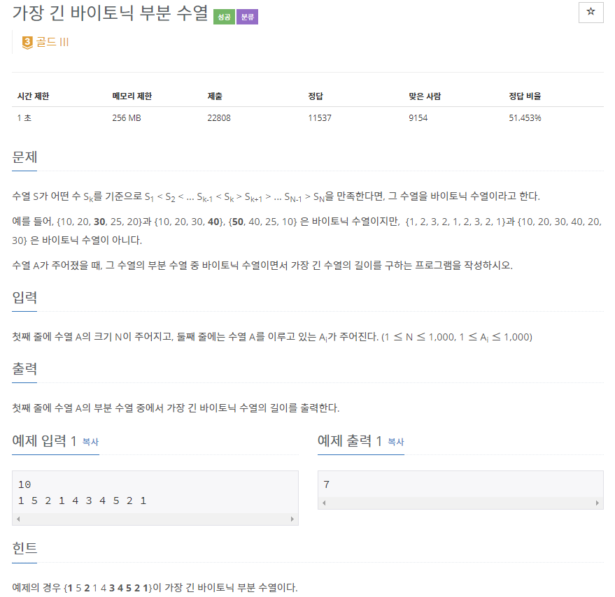

## [[11054] 가장 긴 바이토닉 부분 수열](https://www.acmicpc.net/problem/11054)


___
## 💡풀이
- 동적계획법을 이용하였다.
- Bottom-up 방식으로 구현하였다.
	- [가장 긴 증가하는 부분 수열](https://github.com/seonpilKim/Algorithm/tree/master/Dynamic%20Programming/BOJ/11053)의 길이와 가장 긴 감소하는 부분 수열의 길이의 합 중 가장 큰 값을 찾는 문제이다.
```c++
// Base condition
fill(dp, dp + 1000, 1);
fill(rdp, rdp + 1000, 1);

// Bottom-up
//----------------------------------------------------
// 가장 긴 증가하는 부분 수열
for (int i = 0; i < N; i++) 
    for (int j = 0; j < i; j++) 
        if (seq[j] < seq[i] && dp[i] < dp[j] + 1) 
            dp[i] = dp[j] + 1;

// 가장 긴 감소하는 부분 수열
for (int i = N - 1; i >= 0; i--)
    for (int j = N - 1; j > i; j--)
        if (seq[j] < seq[i] && rdp[i] < rdp[j] + 1)
            rdp[i] = rdp[j] + 1;
//-----------------------------------------------------            
for (int i = 0; i < N; i++) 
    if (longest < dp[i] + rdp[i] - 1) 
        longest = dp[i] + rdp[i] - 1;
    
cout << longest;
```